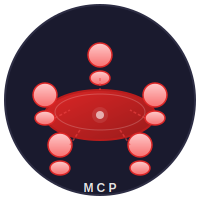

<p align="center">
  
</p>

<h1 align="center">Red Team MCP</h1>

<p align="center">
  <strong>Assemble elite AI agent teams to tackle any challenge</strong>
</p>

<p align="center">
  <a href="#-quick-start">Quick Start</a> •
  <a href="#-features">Features</a> •
  <a href="#-multi-agent-coordination">Multi-Agent</a> •
  <a href="#-mcp-integration">MCP Integration</a> •
  <a href="#-api-reference">API</a>
</p>

<p align="center">
  
  
  
  
</p>

---

Red Team MCP is a multi-agent collaboration platform that connects to **68 providers and 1500+ models** via [models.dev](https://models.dev). Build specialized agent teams, coordinate complex workflows, and integrate seamlessly with VS Code and Claude Desktop through the Model Context Protocol (MCP).

## ✨ Features

<table>
<tr>
<td width="50%">

### 🎯 Universal Model Access

- **68 Providers**: Anthropic, OpenAI, Google, Groq, Mistral, DeepSeek, and 60+ more
- **1500+ Models**: Auto-synced from models.dev
- **Unified API**: One interface for all providers

</td>
<td width="50%">

### 🤖 Multi-Agent Collaboration

- **5 Coordination Modes**: Pipeline, Ensemble, Debate, Swarm, Hierarchical
- **Predefined Teams**: Writing, Marketing, Research, Technical, Executive
- **Custom Teams**: Build your own agent configurations

</td>
</tr>
<tr>
<td width="50%">

### 📡 MCP Integration

- **VS Code Ready**: Works with GitHub Copilot
- **Claude Desktop**: Native integration
- **Dynamic Tools**: All agents exposed as MCP tools

</td>
<td width="50%">

### 🚀 Production Ready

- **FastAPI Backend**: High-performance async API
- **Web Dashboard**: HTMX-powered admin interface
- **Cost Tracking**: Per-request usage analytics

</td>
</tr>
</table>

## 🚀 Quick Start

### Option A: Docker (Recommended)

```bash
git clone https://github.com/yourusername/red-team-mcp.git
cd red-team-mcp
cp .env.example .env
# Edit .env with your API keys

docker compose up -d
# Open http://localhost:8000/ui/
```

### Option B: Local Install

```bash
git clone https://github.com/yourusername/red-team-mcp.git
cd red-team-mcp
python -m venv venv
source venv/bin/activate  # Windows: venv\Scripts\activate
pip install -r requirements.txt
```

### Configure API Keys

```bash
cp .env.example .env
# Edit .env with your API keys
```

### Run

```bash
# Start the web server & dashboard
python main.py serve
# Open http://localhost:8000/ui/

# Or use the CLI
python main.py chat "What is machine learning?"

# Or start the MCP server
python main.py mcp
```

## 🤝 Multi-Agent Coordination

Red Team MCP excels at coordinating multiple AI agents on complex tasks. Choose from 5 coordination modes:

| Mode | Description | Best For |
|------|-------------|----------|
| **Pipeline** | Agents work sequentially, each building on the previous output | Document workflows, iterative refinement |
| **Ensemble** | Agents work in parallel, then synthesize results | Comprehensive analysis, multiple perspectives |
| **Debate** | Agents engage in back-and-forth argumentation | Critical thinking, finding flaws |
| **Swarm** | CrewAI-powered collaboration with delegation | Complex projects, dynamic task allocation |
| **Hierarchical** | Manager agent delegates to specialists | Large teams, structured workflows |

### Predefined Agent Teams

| Team | Agents | Default Mode |
|------|--------|--------------|
| **Writing Team** | Creative Writer, Editor, SEO Specialist | Pipeline |
| **Marketing Team** | Strategist, Brand Manager, Social Media | Hierarchical |
| **Research Team** | Researcher, Data Scientist, Analyst | Ensemble |
| **Technical Team** | Expert, Solutions Architect, Security | Debate |
| **Executive Team** | Strategy, Financial, Operations | Ensemble |

### Example: Multi-Agent Request

```bash
curl -X POST "http://localhost:8000/api/multi-agent" \
  -H "Content-Type: application/json" \
  -d '{
    "query": "Analyze the competitive landscape for AI startups",
    "coordination_mode": "ensemble",
    "agents": ["financial_analyst", "strategy_consultant", "technical_expert"]
  }'
```

## 📡 MCP Integration

Red Team MCP provides a Model Context Protocol server for seamless integration with AI assistants.

### VS Code Setup

Create `.vscode/mcp.json` in your project:

```json
{
  "servers": {
    "red-team-mcp": {
      "command": "python",
      "args": ["-m", "src.mcp_server_dynamic"],
      "cwd": "/path/to/red-team-mcp"
    }
  }
}
```

### Claude Desktop Setup

Add to your Claude Desktop config (`~/Library/Application Support/Claude/claude_desktop_config.json`):

```json
{
  "mcpServers": {
    "red-team-mcp": {
      "command": "python",
      "args": ["/path/to/red-team-mcp/main.py", "mcp"]
    }
  }
}
```

### Available MCP Tools

| Tool | Description |
|------|-------------|
| `list_agents` | List all available agents |
| `list_teams` | List all predefined teams |
| `chat` | Chat with a specific agent |
| `run_team` | Execute a team on a task |
| `coordinate` | Run multi-agent coordination |
| `brainstorm` | Generate multiple perspectives |

## 📖 API Reference

### Chat Endpoint

```http
POST /api/chat
Content-Type: application/json

{
  "agent_id": "creative_writer",
  "message": "Write a tagline for an AI product",
  "temperature": 0.8,
  "max_tokens": 500
}
```

### Multi-Agent Endpoint

```http
POST /api/multi-agent
Content-Type: application/json

{
  "query": "Develop a go-to-market strategy",
  "coordination_mode": "hierarchical",
  "agents": ["marketing_strategist", "sales_analyst"],
  "rebuttal_limit": 3
}
```

### Run Team Endpoint

```http
POST /api/team/{team_id}/run
Content-Type: application/json

{
  "query": "Create a blog post about AI trends",
  "coordination_mode": "pipeline"
}
```

### Additional Endpoints

| Endpoint | Method | Description |
|----------|--------|-------------|
| `/api/agents` | GET | List all agents |
| `/api/teams` | GET | List all teams |
| `/api/models` | GET | List available models |
| `/health` | GET | Health check |
| `/ws/chat` | WS | WebSocket streaming |

## 🏗️ Architecture

```
red-team-mcp/
├── main.py                    # CLI entry point
├── config/config.yaml         # Configuration
├── src/
│   ├── api/                   # FastAPI application
│   │   ├── app.py            # App factory
│   │   ├── endpoints.py      # REST endpoints
│   │   └── websockets.py     # WebSocket handlers
│   ├── agents/               # Agent implementations
│   │   ├── configurable_agent.py
│   │   └── coordinator.py    # Multi-agent coordination
│   ├── web/                  # Dashboard UI
│   │   ├── routes.py
│   │   └── templates/        # HTMX templates
│   ├── providers/            # 68 provider implementations
│   ├── config.py             # Configuration management
│   ├── models.py             # Model selector
│   ├── db.py                 # SQLite persistence
│   └── mcp_server_dynamic.py # MCP server
└── mcp_servers/              # Generated MCP servers
```

## ⚙️ Configuration

### Environment Variables

```bash
# Core providers
ANTHROPIC_API_KEY=your_key
OPENAI_API_KEY=your_key
GOOGLE_API_KEY=your_key
GROQ_API_KEY=your_key
DEEPSEEK_API_KEY=your_key

# And 60+ more providers supported!
```

### config.yaml

```yaml
api:
  host: "0.0.0.0"
  port: 8000
  rate_limit: "100/minute"

models:
  default: "claude-sonnet-4-20250514"

agents:
  predefined:
    - id: my_custom_agent
      name: Custom Agent
      model_id: gpt-4o
      provider: openai
      role: Specialist
      goal: Help with specific tasks
```

## 🧪 Development

```bash
# Run tests
python -m pytest tests/ -v

# Run with hot reload
python main.py serve --reload

# Generate MCP servers
python main.py generate-mcp --all
```

## 📊 Web Dashboard

Access the admin dashboard at `http://localhost:8000/ui/` to:

- 💬 **Chat** with any agent interactively
- 👥 **Manage Teams** and agent configurations
- 📈 **View Statistics** on usage and costs
- ⚙️ **Configure** providers and settings
- 📤 **Export** configurations

## 🤝 Contributing

1. Fork the repository
2. Create a feature branch (`git checkout -b feature/amazing`)
3. Add tests for new functionality
4. Ensure all tests pass (`python -m pytest`)
5. Submit a pull request

## 📄 License

AGPL-3.0 License - see [LICENSE](LICENSE) for details.

## 🙏 Acknowledgments

- [models.dev](https://models.dev) - Comprehensive model database
- [CrewAI](https://crewai.com) - Agent orchestration framework
- [FastAPI](https://fastapi.tiangolo.com) - High-performance web framework
- All 68 AI providers making their models accessible

---

<p align="center">
  <strong>Ready to assemble your AI team?</strong><br>
  <a href="#-quick-start">Get Started →</a>
</p>
