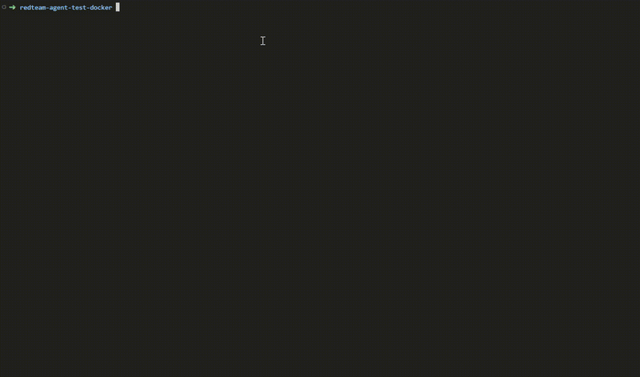
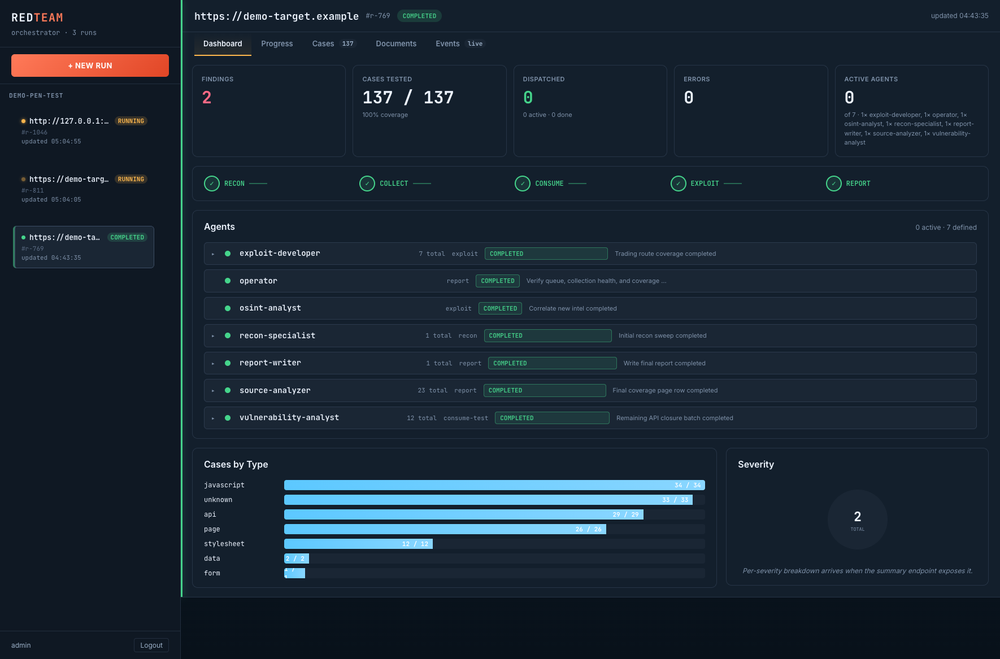

<p align="center">
  <h1 align="center">🔴 RedTeam Agent</h1>
  <p align="center">
    <strong>自主式 AI 红队模拟 Agent</strong>
  </p>
  <p align="center">
    <a href="#安装">安装</a> · <a href="#快速开始">快速开始</a> · <a href="#架构">架构</a> · <a href="README.md">English</a>
  </p>
  <p align="center">
    
    
    
    
    
    
  </p>
</p>

---

RedTeam Agent 是一个支持 **Claude Code**、**OpenCode** 和 **Codex** 的自主红队模拟 Agent。它可以把任意工作空间转换成完整的渗透测试环境，面向 CTF / 靶场目标，内置 **8 个 AI Agent**、**容器化 Kali 工具链**、**流式用例收集管道**，以及 **79 份安全参考资料**。

## 演示





**核心特性：**
- **多 CLI 支持** — 开箱即用支持 Claude Code、OpenCode、Codex
- **自主工作流** — 5 阶段方法论（侦察 → 收集 → 测试 → 利用+OSINT → 报告），尽量减少人工干预；测试阶段是流式、按 stage 路由的 case 流水线，串行派发（每轮一次 fetch + 一个 task）
- **GUI 操作界面** — 本地 Web UI，可查看项目、实时运行、产出物、时间线与终态运行元数据
- **情报收集** — `intel.md` 从侦察到利用持续积累技术栈、人员、域名、凭据等情报；OSINT Agent 进一步补充 CVE、泄露数据、DNS 历史与社工线索
- **8 个专业 Agent** — operator、recon-specialist、source-analyzer、vulnerability-analyst、exploit-developer、fuzzer、osint-analyst、report-writer
- **容器化工具** — 所有渗透工具运行在 Docker 中（Kali 工具箱、mitmproxy、Katana，OpenCode 可选 Metasploit RPC），无需额外本地安装
- **用例收集管道** — 基于 SQLite 的队列，4 个生产者，自动类型分类，调度零 token 消耗，fetch-dispatch 原子配对
- **79 份参考资料** — 涵盖 OWASP Top 10:2025、API Security 2023、攻击战术、AD/Kerberos 等内容
- **断点续扫** — 可以中断并恢复当前 engagement，不丢进度
- **无人值守加固** — 自动恢复卡顿、队列阻塞回收、权限审批阻塞防护（workspace 内严格作用域，避免 OpenCode `external_directory` 审批弹窗中断 `/autoengage` 运行）、Finding 去重、Surface 覆盖强制校验、报告缺失时自动从 engagement 产物合成完整报告

## 安装

### 前置条件

- [Docker](https://docs.docker.com/get-docker/)（含 Docker Compose）
- 如果不用 Docker 一体化运行时，则至少需要一个 AI CLI 工具：
  - [Claude Code](https://docs.anthropic.com/en/docs/claude-code)
  - [OpenCode](https://opencode.ai)（`npm install -g opencode-ai`）
  - [Codex](https://github.com/openai/codex)
- 本地工具：`curl`、`jq`、`sqlite3`（Docker 一体化运行时不需要）
- 不支持原生 Windows / PowerShell

### 安装帮助

```bash
./install.sh -h
```

## 按 CLI 使用

### Docker（推荐）

**安装**

```bash
bash <(curl -fsSL https://raw.githubusercontent.com/NeoTheCapt/RedteamAgent/v0.1.1/install.sh) docker
# 或：
./install.sh docker ~/redteam-docker
./install.sh --force docker ~/redteam-docker
```

**启动**

```bash
cd ~/redteam-docker
./run.sh
```

**运行**

```bash
/engage http://your-ctf-target:8080
/autoengage http://your-ctf-target:8080
```

**说明**
- 这是最干净的运行路径：镜像同时打包 OpenCode、Redteam Agent 与渗透测试工具链。
- `run.sh` 会从镜像内置的干净模板初始化，并把 engagement 产物持久化到 `workspace/`，同时跨重启保留 OpenCode 的 XDG 目录：`opencode-home/`（认证 token）、`opencode-config/`（模型选择）、`opencode-state/`（TUI 状态）。
- 如果不想把任何 OpenCode 状态持久化到容器外，使用 `./run.sh --ephemeral-opencode`（每次启动都要重新配置模型）。
- 安装后如需强制重建镜像，使用 `./run.sh --rebuild`。

### OpenCode（推荐）

**安装**

```bash
bash <(curl -fsSL https://raw.githubusercontent.com/NeoTheCapt/RedteamAgent/v0.1.1/install.sh) opencode
# 或：
./install.sh opencode
./install.sh opencode ~/my-project
./install.sh --dry-run opencode
```

**启动**

```bash
cd ~/redteam-agent
opencode
```

**运行**

```bash
/engage http://your-ctf-target:8080
/autoengage http://your-ctf-target:8080
```

**说明**
- 请在 `.opencode/opencode.json` 中配置 LLM provider。
- OpenCode 可在 `Exploit` 阶段按需使用本地 Metasploit MCP 路径，但只在 finding 明确匹配模块族、服务、产品/版本或 CVE 时启用。

### Claude Code

**安装**

```bash
bash <(curl -fsSL https://raw.githubusercontent.com/NeoTheCapt/RedteamAgent/v0.1.1/install.sh) claude
# 或：
./install.sh claude
./install.sh claude ~/my-project
```

**启动**

```bash
cd ~/redteam-agent
claude
```

**运行**

```bash
/engage http://your-ctf-target:8080
/autoengage http://your-ctf-target:8080
```

### Codex

**安装**

```bash
bash <(curl -fsSL https://raw.githubusercontent.com/NeoTheCapt/RedteamAgent/v0.1.1/install.sh) codex
# 或：
./install.sh codex
./install.sh codex ~/my-project
```

**启动**

```bash
cd ~/redteam-agent
codex
```

**运行**

```text
engage http://your-ctf-target:8080
autoengage http://your-ctf-target:8080
```

**说明**
- Codex 对 slash command 的支持方式与 OpenCode / Claude Code 不同；需要时请用自然语言触发命令。

### 本地 GUI 操作界面（可选）

如果你想跨多个工作区管理任务，或在 CLI 之外查看实时运行状态，可以使用本地 Web UI。

**启动**

```bash
./orchestrator/run.sh
# 或先强制重建 all-in-one 镜像：
./orchestrator/run.sh --rebuild
```

**停止**

```bash
./orchestrator/stop.sh
```

**说明**
- 默认地址：`http://127.0.0.1:18000`
- `./orchestrator/run.sh` 会自动准备后端虚拟环境、按需安装前端依赖，并在启动前完成前端构建。
- UI 可查看项目、实时 run 状态、任务/阶段时间线、产出物，以及 runs API 暴露的终态运行元数据。
- 后端会在 supervisor 丢失或后端重启后自动续跑未完成任务，报告缺失时从 engagement 产物合成完整报告，并执行完成前健康检查——适合长时间无人值守的运行场景。

## 共享产出物

所有运行时都会把 engagement 产物写到：

```text
engagements/<timestamp-target>/
```

常见产出物：
- `findings.md` — 漏洞与证据摘要
- `report.md` — 最终报告
- `log.md` — 执行日志与 operator 时间线
- `intel.md` — 适合日常查看的脱敏情报摘要
- `intel-secrets.json` — 完整 secrets / token
- `auth.json` — 当前认证材料与 session 状态
- `cases.db` — SQLite 队列、分类与执行状态
- `surfaces.jsonl` — 高风险 surface 覆盖跟踪

敏感产出物：
- 不要随意分享 `intel-secrets.json`、`auth.json`，也不要分享还包含 live 凭据、token 或 session 状态的完整 engagement 目录。
- 如需对外分享，优先使用 `report.md`、经过挑选的 `findings.md` 片段，以及审阅/脱敏后的辅助文件。

## Engagement 模式

| | `/engage` | `/autoengage` |
|---|---|---|
| 认证配置 | 让你选择代理 / cookie / skip | 自动 skip；如发现注册入口会自动注册，自动使用发现的凭据 |
| 阶段确认 | 默认自动确认，但首阶段需要确认 | 不提问，所有阶段自动推进 |
| 决策方式 | 默认并行，可改顺序执行 | 固定并行，不给选项 |
| 错误处理 | 遇到异常可能停下 | 记录错误后继续处理下一个任务 |
| 适合场景 | 第一次打目标，需要人工把控 | 重复测试、夜间批量跑、追求最大覆盖 |

Agent 会按 5 个阶段推进：

```text
Phase 1: RECON ─── recon-specialist + source-analyzer（并行）
    │
Phase 2: COLLECT ─ 导入 endpoint → SQLite 队列，启动 Katana 爬虫
    │
Phase 3: TEST ──── 按 stage 路由的 case 流水线（取代旧的强 phase 分隔）：
    │               每个 case 都带独立的 `stage` 字段，与 `status` 解耦。
    │               按 stage + type 路由：
    │                 ingested + {api,form,graphql,upload,websocket} → vuln-analyst
    │                 ingested + {javascript,page,stylesheet,data,unknown,api-spec} → source-analyzer
    │                 vuln_confirmed                                 → exploit-developer
    │                 fuzz_pending                                   → fuzzer（>500 条深度 wordlist）
    │               consume-test 串行派发：每轮 fetch + 一个 task。
Phase 4: EXPLOIT ─ osint-analyst + exploit-developer（并行）
    │              osint-analyst：从 intel.md 提取 CVE / 泄露 / DNS / 社工情报
    │              exploit-developer：利用链分析与影响评估
    │              osint 重新唤起：operator 每轮 tick 调用
    │              `intel_changed_check.sh`，flag 触发新一轮关联分析。
Phase 5: REPORT ─ report-writer 输出覆盖率统计与情报摘要
```

## 常用命令

| 命令 | 说明 |
|------|------|
| `/engage <url>` | 启动新的 engagement（半自主） |
| `/autoengage <url>` | **全自动模式**，零交互、最大覆盖 |
| `/resume` | 恢复被中断的 engagement |
| `/status` | 显示进度面板与队列统计 |
| `/proxy start/stop` | 管理 mitmproxy 抓包代理 |
| `/auth cookie/header` | 配置认证凭据 |
| `/queue` | 查看 case 队列统计 |
| `/report` | 生成最终报告 |
| `/stop` | 停止所有后台容器 |
| `/confirm auto/manual` | 切换自动 / 手动确认模式 |
| `/config [key] [value]` | 查看或设置运行时配置 |
| `/subdomain <domain>` | 枚举目标域名的子域名 |
| `/vuln-analyze` | 分析扫描结果中的漏洞 |
| `/osint` | 对当前 engagement 执行 OSINT 情报收集 |
| `/recon` `/scan` `/enumerate` `/exploit` `/pivot` | 手动覆盖阶段执行 |

### 认证方式

```text
1 — 代理登录（推荐）：/proxy start → 在浏览器里登录
2 — 手动 cookie：/auth cookie "session=abc123"
3 — 手动 header：/auth header "Authorization: Bearer ..."
4 — 跳过：先测未认证面，后续再配置认证
```

## 架构

### 8 个 Agent

```
                    ┌─────────────────────────┐
                    │        OPERATOR          │
                    │   （主控制器，驱动全局）  │
                    └──┬──┬──┬──┬──┬──┬──┬────┘
                       │  │  │  │  │  │  │
  ┌────────────────────┘  │  │  │  │  │  └──────────────────┐
  ▼                       ▼  │  ▼  │  │                     ▼
recon-         source-    │ vuln-  │  │             report-
specialist     analyzer   │ analyst│  │             writer
（网络）         （代码）   │（测试） │  │             （报告）
  │              │        ▼        ▼  ▼
  │              │     fuzzer  exploit-  osint-
  │              │     （模糊） developer analyst
  │              │             （利用）   （OSINT）
  │              │                ▲        │
  │   intel.md ◄─┘                │        │
  └──► intel.md                   └────────┘
                              operator 把
                            OSINT 情报回流给利用阶段
```

### Case 管道

```
生产者                 队列（SQLite）            消费者
┌──────────┐
│ mitmproxy │─┐   ┌──────────┐  ┌────────┐  ┌─ vuln-analyst（api/form）
│ Katana    │─┼──→│ cases.db │─→│dispatch│──┼─ source-analyzer（js/css）
│ recon     │─┤   └──────────┘  │ (.sh)  │  ├─ fuzzer（深度参数）
│ spec      │─┘   去重+状态     └────────┘  └─ exploit-dev（已确认漏洞）
└──────────┘      15 类内容       零 token       ▲
     ▲                                           │
     └──────────── 新 endpoint 回流 ─────────────┘
```

### 目录结构

```
RedteamOpencode/                ← 开发工作区（git 根目录）
├── install.sh                  ← 把 agent/ 安装到 ~/redteam-agent
├── README.md                   ← 英文说明
├── README.zh.md                ← 中文说明
│
├── agent/                      ← 所有 agent 运行时文件（实际被安装的内容）
│   ├── CLAUDE.md               ← Claude Code operator prompt
│   ├── AGENTS.md               ← Codex operator prompt
│   ├── .opencode/              ← OpenCode 配置与唯一事实源
│   │   ├── opencode.json       ← agent 元数据、skills、commands、plugins
│   │   ├── prompts/agents/     ← 8 个 agent prompt（.txt）— 唯一事实源
│   │   ├── commands/           ← 19 个 slash command（.md）— 唯一事实源
│   │   └── plugins/            ← engagement hooks（TypeScript）
│   ├── .claude/                ← Claude Code 配置（agents + commands 为生成产物）
│   │   └── settings.json       ← hooks（scope check + auto-logging）
│   ├── .codex/                 ← Codex 配置（agents 为生成产物）
│   ├── scripts/
│   │   ├── install-time generators ← install.sh 生成 .claude/agents + .codex/agents + .claude/commands
│   │   ├── dispatcher.sh       ← case 队列管理
│   │   └── ...                 ← ingest、hooks、共享库
│   ├── skills/                 ← 31 个攻击方法技能
│   ├── references/             ← 79 份参考资料（OWASP、工具、战术、AD）
│   ├── docker/                 ← Dockerfile + docker-compose.yml
│   └── engagements/            ← 每次 engagement 的运行输出目录
│
└── orchestrator/               ← 可选的 Web UI（FastAPI 后端 + React 前端）
    ├── backend/                ← Python API；通过 agent_source_dir 读取 agent/
    └── frontend/               ← React shell（Documents / Events / Progress / Cases 页签）
```

## CLI 兼容性

| 功能 | Claude Code | OpenCode | Codex |
|------|-------------|----------|-------|
| Operator prompt | `CLAUDE.md` | `.opencode/prompts/agents/operator.txt` | `AGENTS.md` |
| Subagents（8） | 生成的 `.claude/agents/*.md` | `.opencode/prompts/agents/*.txt` **（源文件）** | 生成的 `.codex/agents/*.toml` |
| Slash commands（19） | 生成的 `.claude/commands/*.md` | `.opencode/commands/*.md` **（源文件）** | 不支持 — 用自然语言代替 |
| Skills（32） | `skills/*/SKILL.md`（按需读取） | 通过 instructions 数组加载 | `skills/*/SKILL.md`（按需读取） |
| 构建方式 | `install.sh claude` 在安装时生成 agents + commands | N/A（直接用源文件） | `install.sh codex` 在安装时生成 agents |
| 自动日志 | `.claude/settings.json` hooks | `.opencode/plugins/engagement-hooks.ts` | N/A |
| Scope enforcement | hook 阻断超范围 | hook 警告超范围 | N/A |
| Agent attribution | hook JSON 里的 `agent_type` | `chat.message` 事件跟踪 | N/A |

**仅开发态使用的 wrapper**
- `agent/.claude/agents/operator.md` 和 `agent/.codex/agents/operator.toml` 只服务源码仓库内开发。
- 安装后的 Claude/Codex 工作区以 `CLAUDE.md` 或 `AGENTS.md` 作为 operator 入口，只安装生成出来的 subagents。

## 自定义

### 添加一个 Skill

```bash
mkdir agent/skills/my-skill
# 在 agent/skills/my-skill/SKILL.md 中写 frontmatter + methodology
# 把 "skills/my-skill/SKILL.md" 加到 agent/.opencode/opencode.json 的 instructions 数组
```

### 添加参考资料

将文件放到 `agent/references/<category>/`，并同步更新 `agent/references/INDEX.md`。

### 切换 LLM Provider（OpenCode）

编辑 `agent/.opencode/opencode.json` 里的 `model`。支持 Anthropic、OpenAI、Google、Ollama。

### 按项目配置

每个项目保存独立的配置，项目下所有 run 都继承。通过 Sidebar 或 NewRunForm 中的 **Edit project** 按钮打开 Project Edit 弹窗，包含 6 个 tab：

| Tab | 字段 | 注入到运行时容器的环境变量 |
|-----|------|---------------------------|
| **Model** | provider_id, model_id, small_model_id, api_key, base_url | `REDTEAM_OPENCODE_MODEL`, `REDTEAM_OPENCODE_SMALL_MODEL`, `OPENAI_API_KEY`, `OPENAI_BASE_URL`（Anthropic 同理）|
| **Auth** | cookies / headers / tokens 的 JSON | 写入 seed 目录的 `auth.json` |
| **Env** | 自由 JSON `{"VAR": "value"}` | 合入容器 env |
| **Crawler** | Katana 爬虫参数 | `KATANA_CRAWL_DEPTH`, `KATANA_CRAWL_DURATION`, `KATANA_TIMEOUT_SECONDS`, `KATANA_CONCURRENCY`, `KATANA_PARALLELISM`, `KATANA_RATE_LIMIT`, `KATANA_STRATEGY`, `KATANA_ENABLE_HYBRID`, `KATANA_ENABLE_XHR`, `KATANA_ENABLE_HEADLESS`, `KATANA_ENABLE_JSLUICE`, `KATANA_ENABLE_PATH_CLIMB` |
| **Parallel** | 并发上限 | `REDTEAM_MAX_PARALLEL_BATCHES` |
| **Agents** | 启用/禁用各 subagent | `REDTEAM_DISABLED_AGENTS`（任何 agent 被禁用时输出逗号分隔列表）|

**默认值**：每类配置默认为 JSON `{}`。key 不存在时运行时回退到 `.env` 或 agent 内建默认。只在显式设置时才覆盖。

**优先级**：`crawler_json` / `parallel_json` / `agents_json` 优先于自由形式的 `env_json`。清空字段用 `""`（空字符串），不是 `null`。

## 开发

### 目录约定（贡献前必读）

仓库有**严格的三层划分**，不要跨层：

| 层 | 职责 | 示例内容 |
|----|------|---------|
| **根目录** | 仅 meta —— 安装脚本、文档、CI | `install.sh`、`README*.md`、`.gitignore`、`docs/` |
| **`agent/`** | 所有 agent 运行时（**事实源**） | `.opencode/`、`scripts/`、`skills/`、`references/`、`docker/`、prompts、operator 核心 |
| **`orchestrator/`** | 可选 Web UI（只读 `agent/`，不依赖根目录副本） | `backend/`（FastAPI）、`frontend/`（React） |

**规则**：`agent/` 是 agent 运行时的唯一事实源。orchestrator 后端把 `agent_source_dir = REPO_ROOT / "agent"` 写死在 `orchestrator/backend/app/config.py:17`，并由此同步到每次 engagement 的 workspace。`install.sh` 也从 `agent/` 复制到目标目录。

**禁止**在仓库根目录新建 `/.opencode/`、`/scripts/`、`/skills/`、`/references/` 或 `/docker/`。请改动 `agent/` 下的对应副本。

已有两层防护：

1. **`.gitignore`** 在 `git add` 阶段就拦住这些路径。
2. **pre-commit hook**：`agent/scripts/hooks/block-root-dup-dirs.sh` 会拒绝含这些路径的提交。每次 clone 后需手动安装一次：

   ```bash
   cp agent/scripts/hooks/block-root-dup-dirs.sh .git/hooks/pre-commit
   chmod +x .git/hooks/pre-commit
   ```

### 在哪里运行 CLI

- **根目录**（`RedteamOpencode/`）：开发工作区。需要做仓库级工具（测试、文档、orchestrator 开发）时在这里运行 CLI。
- **`agent/`**：运行时主场。做 engagement 时，在 `agent/`（或安装后的 `~/redteam-agent/`）里运行 CLI。

### 单一事实源架构

Agent prompt 和 command 只在 OpenCode 格式下维护（`.opencode/`）。Claude Code 和 Codex 的版本都由 `install.sh` 在安装时生成：

```bash
# install.sh 会按目标产品生成安装产物：
./install.sh claude ~/my-project   # 生成 .claude/agents/*.md + commands
./install.sh codex ~/my-project    # 生成 .codex/agents/*.toml
./install.sh opencode ~/my-project # 直接复制 .opencode/（无需构建）
```

**修改某个 agent：** 编辑 `agent/.opencode/prompts/agents/<name>.txt`，然后重新执行目标产品的 `install.sh`。

**新增某个 agent：** 创建对应 `.txt` 文件，在 `opencode.json` 中注册，再重新执行 `install.sh`。

**Operator prompt** 使用混合模型：
- `agent/.opencode/prompts/agents/operator.txt` 仍然是 OpenCode 的源 prompt
- `agent/operator-core.md` 是 Claude/Codex 共享的方法论正文
- `agent/scripts/render-operator-prompts.sh` 负责渲染 `CLAUDE.md`、`AGENTS.md` 和薄 wrapper
- `bash tests/agent-contracts/check-operator-prompts.sh` 用来校验生成产物是否仍保持同步

## 故障排查

| 问题 | 处理方式 |
|------|----------|
| Docker 镜像构建失败 | `docker system prune -af && cd agent/docker && docker compose build --no-cache` |
| 拉取 Kali 包时 Docker 构建失败 | 重新执行构建。Dockerfile 已配置 apt 重试/超时并固定到官方 Kali 镜像源，但短暂的网络抖动仍可能需要再跑一次。 |
| Katana 启动失败 | 检查：`docker logs redteam-katana` |
| Agent 拒绝测试目标 | 调整 `agent/CLAUDE.md` 或 `agent/.opencode/instructions/INSTRUCTIONS.md` 里的认证边界 |
| 队列显示 0 cases | 运行 `/status`，确认 Collect 阶段是否实际执行 |
| ProviderModelNotFoundError | 在 `agent/.opencode/opencode.json` 里设置 `model` |

## 许可

仅限授权安全测试使用。不要对未明确授权的目标使用本项目。
