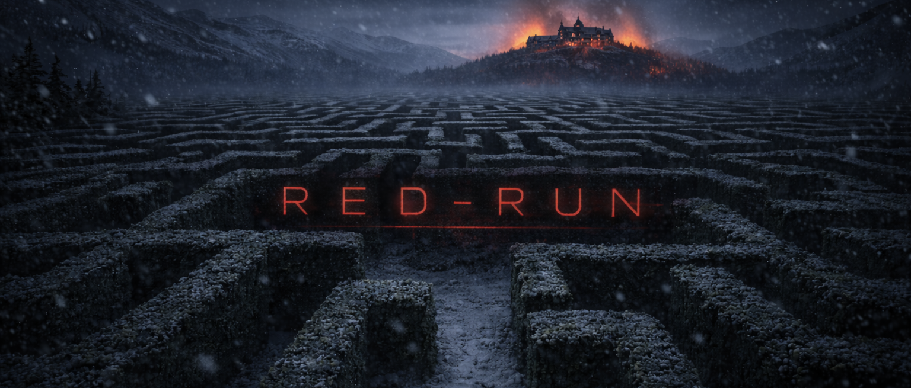

# red-run

Security assessment toolkit for Claude Code.

<p align="center">
  
</p>

red-run combines skills, MCP servers, and Claude Code agent teams with routing logic that guides Claude and the operator through the phases of a security assessment — recon, initial access, lateral movement, privilege escalation, and post-access. It tracks engagement state in a SQLite database that persists across context compactions, routes to skills via semantic search (RAG), and delegates execution to persistent domain teammates that accumulate context across tasks.

The orchestrator (team lead) presents the assessment surface, chain analysis, and available paths — you choose what to test next. Teammates work in their own tmux panes where you can watch them, press Escape to interrupt, and type directly to redirect. See [Agent Teams](#agent-teams) below for setup.

## Orchestrators

red-run supports multiple orchestrator variants that share the same skills, MCP servers, and engagement state. Each variant targets a different use case. Community contributions welcome.

| Orchestrator | Trigger | Status | Purpose |
|---|---|---|---|
| `/red-run-ctf` | `/red-run-ctf` | **Active** | CTF and lab environments. Agent teams with persistent teammates, full autonomy. |
| `/red-run-legacy` | `/red-run-legacy` only | **Legacy** | Original subagent-based orchestrator. Ephemeral agents, one skill per invocation. |
| `/red-run-notouch` | `/red-run-notouch` only | **Planned** | DLP-safe mode. The operator executes commands in separate tmux panes and reports sanitized output back to the orchestrator. No client data touches Anthropic servers. |
| `/red-run-train` | `/red-run-train` only | **Planned** | Training mode. Guided walkthrough with explanations at each step. Designed for learning security assessment methodology with AI assistance. |

All orchestrators write to the same `engagement/state.db` — an engagement started with one variant can be resumed with another.

## Documentation

Full documentation is available at the [docs site](https://blacklanternsecurity.github.io/red-run/):

- [Architecture](https://blacklanternsecurity.github.io/red-run/architecture/) — platform vs strategy layers, prompt architecture, data flow
- [Installation](https://blacklanternsecurity.github.io/red-run/installation/) — prerequisites, setup, sandbox configuration
- [Running an Engagement](https://blacklanternsecurity.github.io/red-run/running-an-engagement/) — end-to-end operator guide
- [MCP Servers](https://blacklanternsecurity.github.io/red-run/mcp-servers/) — nmap, shell, browser, state, skill-router
- [Writing Skills](https://blacklanternsecurity.github.io/red-run/writing-skills/) — contributor guide for new skills

See also: [Skills Inventory](docs/skills-inventory.md) for the full skill inventory.

## Installation

**Prerequisites:** Linux VM with pentesting tools, [Claude Code](https://docs.anthropic.com/en/docs/claude-code), [uv](https://docs.astral.sh/uv/), [Docker](https://docs.docker.com/engine/install/). Optional: [Sliver](https://github.com/BishopFox/sliver) for C2 integration.

```bash
./install.sh          # Symlink-based (edits reflect immediately)
./install.sh --copy   # Copy-based (standalone machines)
./uninstall.sh        # Remove everything
```

The installer sets up the orchestrator, teammate templates, and MCP servers, indexes `skills/` into ChromaDB for semantic retrieval, and starts the shell-server. The repo must stay in place — skill-router reads from `skills/` at runtime.

After installing, run the preflight check to verify attackbox dependencies (nmap, ffuf, sqlmap, hashcat, impacket, etc.):

```bash
bash preflight.sh
```

Then launch:

```bash
./run.sh              # shell-server only (default)
```

### C2 integration (optional)

red-run works out of the box with shell-server (raw TCP reverse shells + interactive processes). For C2 support, run the config wizard before launching:

```bash
bash config.sh             # select C2 backend, generate operator configs
./run.sh                   # starts C2 daemon + MCP automatically
```

`config.sh` writes `engagement/config.yaml` and patches `.mcp.json` with the C2 MCP server entry. The orchestrator skips its built-in config wizard when `config.yaml` exists. Currently supported: Sliver. Custom C2 integration via operator-provided MCP servers is also supported.

The shell-server runs as a persistent SSE service (`127.0.0.1:8022`) shared across all teammates — sessions created by one teammate are visible to all others. `run.sh` starts it automatically and is idempotent (safe to re-run). A `SessionStart` hook also attempts auto-start as a fallback.

See [dependencies](docs/dependencies.md) for the full list of required tools.

## Agent Teams

red-run uses [Claude Code agent teams](https://code.claude.com/docs/en/agent-teams) to coordinate multiple Claude Code sessions working together. The orchestrator runs as the team lead, spawning persistent domain teammates that each get their own tmux pane. Teammates are split into enumeration (net-enum, web-enum, ad-enum, lin-enum, win-enum) and operations (web-ops, ad-ops, lin-ops, win-ops) pairs for parallel discovery and technique execution, plus on-demand specialists (bypass, spray, recover, research). Benefits over the legacy subagent model:

- **Persistent context** — teammates accumulate knowledge across tasks instead of starting fresh each time
- **Teammate messaging** — teammates report findings to the lead who routes to the right specialist (e.g., web teammate finds domain creds → lead routes to AD teammate)
- **Operator visibility** — watch all teammates working in split tmux panes, press Escape to interrupt any teammate, type directly to redirect
- **Shared task list** — coordinated parallel work with the lead assigning all tasks

Agent teams requires the Claude Code experimental feature flag. The repo's `.claude/settings.json` already includes this:

```json
{
  "env": {
    "CLAUDE_CODE_EXPERIMENTAL_AGENT_TEAMS": "1"
  }
}
```

No manual setup needed — cloning the repo and running `./install.sh` is sufficient. For split-pane teammate visibility, start Claude Code inside a tmux session. Without tmux, teammates run in-process (cycle with Shift+Down - this is not recommended for optimal control).

Agent teams works in standard permission mode — teammate permission requests surface to the operator for approval. The orchestrator's `AskUserQuestion` gates provide human-in-the-loop control for all routing decisions.

## State Dashboard

Browser-based read-only dashboard for `engagement/state.db` with an access chain graph and live SSE updates:

```bash
bash operator/state-viewer/start.sh
```

Open `http://127.0.0.1:8099` to see targets, credentials, access, vulns, pivots, tunnels, blocked techniques, and an event timeline — all updating in real-time as teammates work. The access chain graph supports fullscreen mode for detailed review.

To access from a host machine (when red-run is in a VM), generate an auth token — the server will bind to `0.0.0.0` and require the token to access any page:

```bash
bash operator/state-viewer/generate-token.sh
```

See `operator/state-viewer/README.md` for details.

## Running

```bash
./run.sh                # starts shell-server + Claude Code, loads /red-run-ctf
./run.sh --lead=legacy  # loads /red-run-legacy instead
./run.sh --yolo         # skip permission prompts
```

Send any message (e.g., a target IP) to activate the orchestrator. The orchestrator presents routing decisions for operator approval before assigning any task. Run from an isolated VM or dedicated pentesting machine. You are responsible for containing Claude on your systems and for any legal consequences under the CFAA or equivalent legislation.

## Disclaimer

**By using red-run you accept full responsibility for its actions.** This tool runs fully autonomous AI agents that execute offensive security techniques — port scanning, vulnerability exploitation, credential attacks, privilege escalation, and lateral movement — against targets you specify.

- **Authorization required.** Do not use against systems without explicit written permission. Unauthorized access to computer systems is illegal under the CFAA (18 U.S.C. § 1030) and equivalent laws in other jurisdictions.
- **CTF and lab use only.** The current version of the orchestrator is a CTF solver — it runs fully autonomous agents with no OPSEC considerations. Skills are baseline templates built by AI and have not been thoroughly reviewed by human eyes. Expect gaps, false positives, and techniques that need validation before use on real infrastructure. See the [architecture docs](docs/architecture.md) for the production engagement roadmap.
- **No OPSEC guarantees.** Agents run with no stealth considerations. Assume all activity is logged and detectable. Do not rely on red-run for covert operations.
- **Content policy warnings.** red-run's autonomous agents generate and execute offensive security commands. This may trigger Anthropic content policy warnings on your account. We are not responsible for the standing of your Anthropic account — use at your own risk.
- **No warranty.** red-run is provided as-is. The authors are not liable for any damage, data loss, legal consequences, or other harm resulting from its use.
