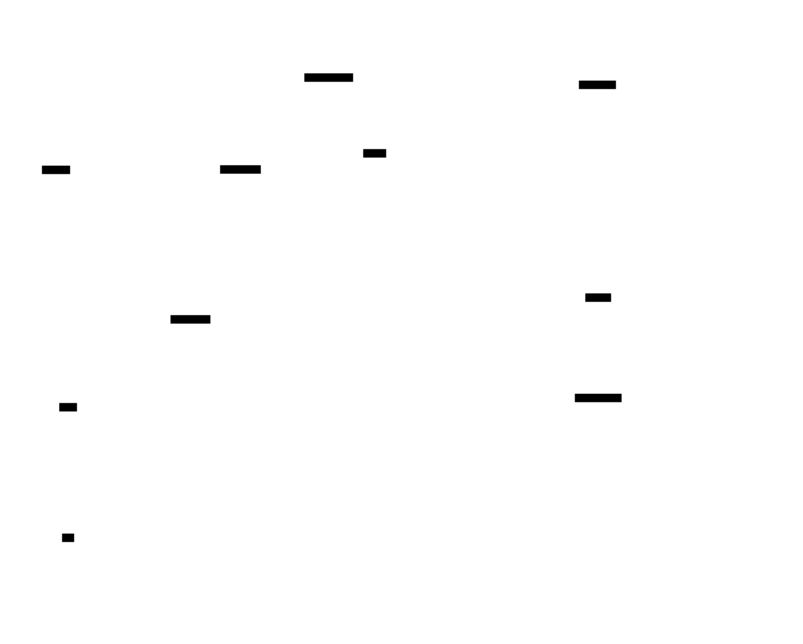

# red-run

Offensive security toolkit for Claude Code.

<p align="center">
  
</p>

red-run turns Claude Code into a penetration testing platform. It combines a library of technique skills, persistent shell sessions, headless browser automation, and engagement state tracking — all orchestrated through agent teams that guide Claude through multi-phase assessments.

## What it does

An **orchestrator** (team lead) runs in your main conversation. You give it targets and it presents the assessment surface, available paths, and chain analysis. You choose what to test next. The lead assigns tasks to persistent domain teammates that load skills, execute methodology, and message findings back. State persists in SQLite across context compactions so nothing is lost during long engagements.

**Key capabilities:**

- **Skill-driven methodology** — 67 skills covering web exploitation, Active Directory attacks, privilege escalation, network recon, evasion, and credential recovery. Each skill embeds payloads, tool commands, troubleshooting, and OPSEC guidance.
- **Persistent shell sessions** — Reverse shells and interactive tools (evil-winrm, psexec.py, ssh, msfconsole) maintain state across teammate tasks via the shell MCP server.
- **Headless browser automation** — Playwright-backed browser sessions handle CSRF tokens, JavaScript-rendered forms, and multi-step auth flows that curl can't.
- **Semantic skill routing** — ChromaDB + sentence-transformer embeddings match attack scenarios to the right skill via natural language search.
- **Engagement state tracking** — SQLite database tracks targets, credentials, access, vulnerabilities, pivot paths, and blocked techniques. Drives automated chaining.
- **Retrospectives** — Post-engagement analysis identifies skill gaps and routing mistakes for continuous improvement.

## Quick start

```bash
git clone https://github.com/blacklanternsecurity/red-run.git
cd red-run
./install.sh
```

Then start Claude Code from the repo directory and tell it what to attack:

> "Scan and attack 10.10.10.5"

See [Installation](installation.md) for prerequisites and detailed setup.

## How it works

<p align="center">
  
</p>

The lead makes every routing decision. When an enumeration teammate identifies a finding, the lead searches for the matching technique skill and assigns it to the right operations teammate with context — injection point, target technology, working payloads. All state writes go through state-mgr for deduplication and provenance tracking.

See [Architecture](architecture.md) for the full design and [Teammates](agents.md) for the teammate model.

## Documentation

| Page | Contents |
|------|----------|
| [Installation](installation.md) | Prerequisites, setup, sandbox config |
| [Dependencies](dependencies.md) | Attackbox tool inventory — everything skills need pre-installed |
| [Architecture](architecture.md) | Platform vs strategy layers, data flow |
| [MCP Servers](mcp-servers.md) | The 6 MCP servers and their tools |
| [Teammates](agents.md) | Teammate model, enum/ops split, state access |
| [Engagement State](engagement-state.md) | SQLite schema, 3-mode architecture, chaining |
| [Writing Skills](writing-skills.md) | Skill format, conventions, templates |
| [Skills Reference](skills-reference.md) | Full skill inventory by category |
| [Running an Engagement](running-an-engagement.md) | Workflow walkthrough |
| [Dashboard](dashboard-and-monitoring.md) | Live monitoring and event polling |

## Disclaimer

> **Authorized use only:** For use in **authorized security testing and educational contexts only**. Do not use against systems without explicit written permission. Skills are baseline templates — expect gaps and techniques that need validation against real targets. While skills include OPSEC notes where relevant, do not trust red-run to maintain OPSEC in production environments without dedicated review and testing.
>
> You are responsible for containing Claude on your systems and for any legal consequences under the CFAA or equivalent legislation.
