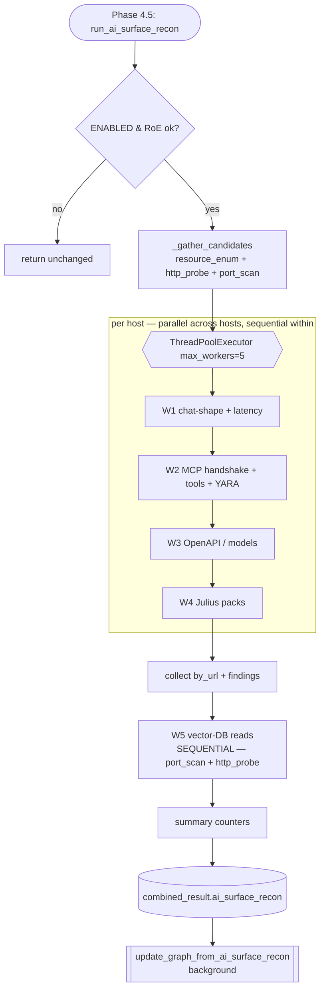
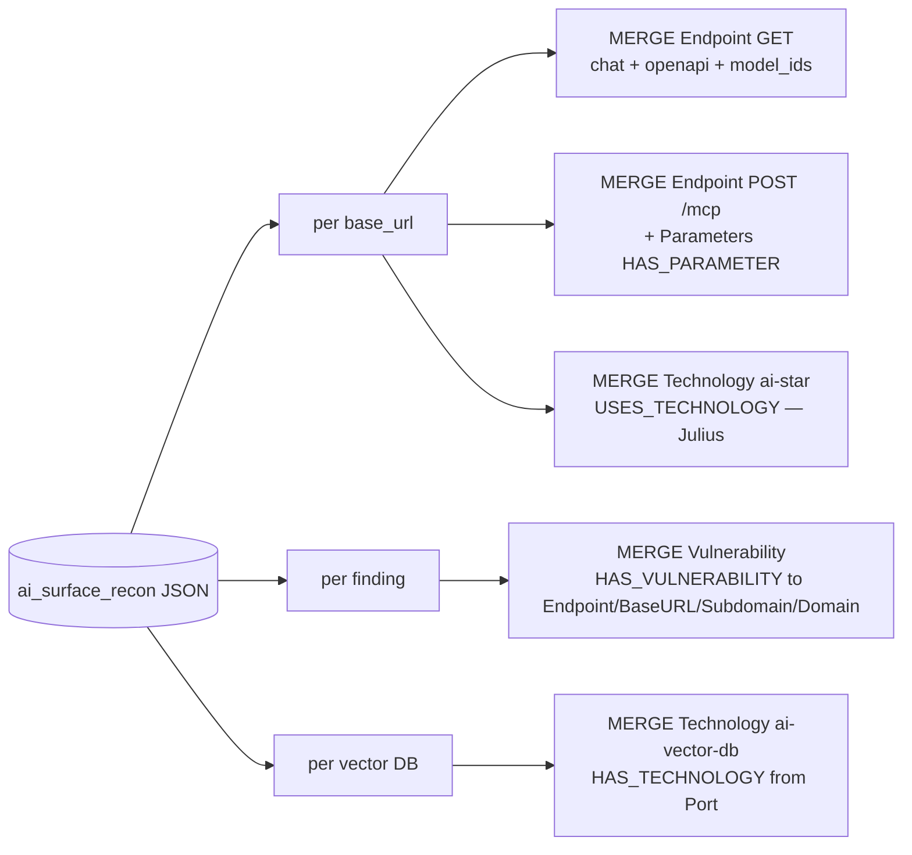

# AI Surface Recon — Complete Module Documentation

*A guide for new users and developers. Read top-to-bottom the first time; use the
table of contents as a reference afterwards.*

---

## Table of contents

1. [What this module is (in plain terms)](#1-what-this-module-is-in-plain-terms)
2. [The mental model](#2-the-mental-model)
3. [Where it runs in the pipeline](#3-where-it-runs-in-the-pipeline)
4. [The graph node model (read this before the workloads)](#4-the-graph-node-model)
5. [Candidate gathering — who gets probed](#5-candidate-gathering)
6. [The workloads](#6-the-workloads)
   - [Workload 1 — Chat-shape probe](#workload-1--chat-shape-probe)
   - [Workload 2 — MCP handshake + tools + YARA](#workload-2--mcp-handshake--tools--yara)
   - [Workload 3 — OpenAPI / manifest / model listing](#workload-3--openapi--manifest--model-listing)
   - [Workload 4 — Julius probe pack](#workload-4--julius-probe-pack)
   - [Workload 5 — Vector-DB confirmation reads](#workload-5--vector-db-confirmation-reads)
   - [Workloads 6 & 7 — latency + glue](#workloads-6--7--latency--glue)
7. [The output blob](#7-the-output-blob)
8. [Partial recon (re-run on demand)](#8-partial-recon)
9. [Settings & stealth](#9-settings--stealth)
10. [Developer guide: extend, test, deploy](#10-developer-guide)
11. [File map](#11-file-map)

---

## 1. What this module is (in plain terms)

Modern targets don't just run web servers — they run **AI infrastructure**: LLM
chat APIs (OpenAI-compatible, Anthropic, Ollama…), **MCP servers** (tool
gateways an AI agent can call), **vector databases** (the memory behind RAG),
model runtimes (vLLM, TGI), and AI frameworks (LangChain, LlamaIndex). Each of
these is an attack surface with its own protocol, its own misconfigurations, and
its own risk classes (prompt injection, tool poisoning, exposed RAG corpora,
leaked model inventories).

**Generic web recon can't see most of this.** A crawler finds a URL like
`/v1/chat/completions` but doesn't know it's an LLM endpoint, what dialect it
speaks, whether it streams, or which model family sits behind it. Confirming
that requires *protocol-aware* probing: send a chat-shaped request and read the
response shape; perform an MCP handshake; read a vector DB's collection list.

**AI Surface Recon is the module that does exactly that.** It is the
**detection / fingerprinting half** of RedAmon's adversarial-AI pipeline:

> It sends *benign* shape-probes, statically analyzes MCP manifests, parses API
> specs, runs a declarative fingerprint engine, and writes the results onto the
> knowledge graph as property annotations plus a few Vulnerability findings.

What it is **not**: it does not jailbreak, prompt-inject, fuzz, mutate, or judge.
Those are the job of later *offensive* containers. This module answers one
question only:

> **"What AI surface is here, and what shape is it?"**

Everything it sends is benign (a 1-token `"ping"`, a standard MCP `initialize`, a
GET to a health endpoint), it never presents credentials, and it treats an auth
wall (`401`) as a *positive signal* rather than something to defeat.

---

## 2. The mental model

Three ideas explain almost every design decision in the module:

1. **Gate first, probe second.** It does not blast every host. A host is probed
   only if an earlier phase already saw an AI signal on it (an AI header, an AI
   port, a classified chat/MCP path). This keeps the module cheap and quiet.

2. **Candidate → confirmation.** A signal (an open port, a path name) is a
   *guess*. The module turns guesses into *facts* by actively confirming them —
   e.g. an open port `6333` is "maybe qdrant"; a successful read of
   `/collections` returning `{"result":…}` is "qdrant, confirmed, and its data is
   readable unauthenticated."

3. **Annotate, don't duplicate.** It introduces **no new node labels.** It
   enriches the `Endpoint`, `Parameter`, `Technology`, and `Port` nodes that
   other phases already created, and adds `Vulnerability` nodes for findings.
   Every annotation is written with Neo4j `COALESCE` so re-runs never overwrite
   prior values (write-once-keep).

**Failure-soft everywhere.** The heavy third-party libraries (`mcp`, `yara`,
`prance`, `jq`, `PyYAML`) are imported *lazily inside the function that needs
them*. If one is missing (e.g. the image wasn't rebuilt yet), only that one
workload degrades — the rest of the module, and the whole recon job, keep going.
A per-host exception is caught and logged; one bad host never aborts the others.

---

## 3. Where it runs in the pipeline

It is **Phase 4.5** ("GROUP 4.5"), running **after `resource_enum`** (the
crawl + endpoint classifier) at every call site. It is gated purely on the
`AI_SURFACE_RECON_ENABLED` setting (the `js_recon` pattern), **not** on
`SCAN_MODULES`. The wiring lives in
[`_maybe_run_ai_surface`](../recon/main.py#L372) (called from main.py:912, 1417, 1882).

```
domain_recon → port_scan / nmap → http_probe → resource_enum → [ AI SURFACE RECON 4.5 ] → vuln_scan …
                    │                  │              │
   ports/services ──┘   AI headers/────┘   classified ┘
                        titles/favicon     endpoints
```

It reads three products that earlier phases left in the in-memory
`combined_result` dict, runs its workloads, writes a new
`combined_result["ai_surface_recon"]` blob, then kicks a **background graph
update** (`update_graph_from_ai_surface_recon`).

| Reads (input) | From | Meaning |
|---|---|---|
| `resource_enum.by_base_url` | the crawler | endpoints already classified with `ai_interface_type` |
| `http_probe.by_url` | the HTTP prober | per-URL AI flags: `is_ai_framework_detected`, `ai_framework_name` |
| `port_scan.by_host` | naabu/masscan/nmap | open ports per host (AI ports, vector-DB ports) |

| Writes (output) | To |
|---|---|
| `ai_surface_recon` JSON blob | `combined_result` (and the on-disk recon file) |
| graph annotations + findings | Neo4j, via the mixin (background) |

---

## 4. The graph node model

Read this once and the per-workload "output nodes" sections will make sense. The
module touches six node types and creates one:

| Node | Role here | Created or reused? |
|---|---|---|
| **`Endpoint`** | the unit most AI annotations hang on. Two distinct ones per host: a `GET` "primary" endpoint (chat / OpenAPI / Julius props) and a `POST /mcp` endpoint (MCP props). | **MERGE** (reused if the crawler made it, else created) |
| **`Parameter`** | one per MCP tool argument; flags prompt-injectable args. | MERGE, linked `(:Endpoint)-[:HAS_PARAMETER]->(:Parameter)` |
| **`Technology`** | confirmed AI products (`ai-runtime`, `ai-vector-db`, …). | MERGE, linked `USES_TECHNOLOGY` (from Endpoint) or `HAS_TECHNOLOGY` (from Port) |
| **`Port` / `IP`** | vector-DB confirmation attaches Technology to the Port. | reused (read-only match) |
| **`BaseURL` / `Subdomain` / `Domain`** | fallback attachment points for findings. | reused (read-only match) |
| **`Vulnerability`** | MCP tool-poisoning / injection findings. | **CREATE** (idempotent by deterministic id) |

**Naming convention:** every AI property is prefixed `ai_` or `is_ai_`, and any
AI *value* on a generically-named field (`Technology.category`) is prefixed
`ai-`. So you can always tell an AI annotation at a glance.

---

## 5. Candidate gathering

Before any probe fires, [`_gather_candidates`](../recon/main_recon_modules/ai_surface_recon.py#L97)
builds the list of hosts worth probing. A host (`base_url`) becomes a candidate
if **any** of these is true:

- a crawled endpoint is classified `llm-chat`, `llm-completion`, `sse-stream`, or `mcp`; **or**
- `_host_has_ai_signal()` is true — `http_probe` flagged an AI framework on that host, **or** the host has an open **AI port** (`cat.lookup_ai_port(port)` hits); **or**
- the host carries an AI-framework flag in `http_probe` but had no crawled endpoints (added with an empty endpoint list — probed later with static fallback paths).

RoE (rules-of-engagement) filters then drop out-of-scope hosts and any
time-window-blocked run. The surviving candidates are fanned across a thread
pool. Result shape:

```python
candidates = {
  "https://host:port": {
     "host_is_ai": True,
     "endpoints": [{"path": "/v1/chat/completions", "method": "POST", "iface": "llm-chat"}, ...]
  }
}
```

**Parallelism:** hosts run **concurrently** in a
`ThreadPoolExecutor(max_workers=5)` (stealth = 2). Within a single host,
Workloads 1→2→3→4 run **sequentially** on one shared `requests.Session`.
Workload 5 (vector DBs) runs **after** the pool drains, single-threaded, because
it iterates ports, not crawl candidates.

---

## 6. The workloads

Each workload is independently toggled by a setting and is failure-soft. The
per-host driver is [`_analyze`](../recon/main_recon_modules/ai_surface_recon.py#L603).

---

### Workload 1 — Chat-shape probe

**Function:** [`_probe_chat`](../recon/main_recon_modules/ai_surface_recon.py#L132) · **Setting:** `AI_SURFACE_RECON_CHAT_SHAPE_PROBE_ENABLED`

#### What it does and why
This workload confirms an LLM chat endpoint and tells you what *dialect* and
*shape* it has. Knowing a host runs a chat API — and whether it streams, what
model family backs it, and whether it's auth-gated — is the foundation for every
later offensive step (prompt-injection targeting, rate-limit probing,
model-specific jailbreaks).

It works **without any API key**, because the *way a server rejects you* is itself
the fingerprint: a real OpenAI-compatible server answers `model:"probe"` with a
`401`/`422` whose body is an OpenAI-style `{"error":…}` envelope. That envelope
proves the protocol without a successful completion.

#### Input
- **From `combined_result`:** the candidate's chat-classified endpoint paths
  (`iface ∈ {llm-chat, llm-completion, sse-stream}`); if none and the host is
  AI-flagged, the 17 static fallback paths in
  [`AI_CHAT_PROBE_PATHS`](../recon/helpers/ai_signal_catalog.py#L1470) (OpenAI,
  Groq's `/openai/...` prefix, Anthropic `/v1/messages`, Cohere `/v2/chat`,
  Perplexity `/v1/sonar`, Mistral FIM, Ollama, TGI `/generate_stream` &
  `/invocations`, …).
- **Originating graph nodes (input nodes):** `BaseURL` → `Endpoint`
  (`ai_interface_type` set by the crawler), and the host's AI `Port`/`Technology`
  signal that made it a candidate.

#### How it works
1. Build the path list (known chat paths, else the static fallback). Cap at 24.
2. POST a benign body — `{"model":"probe","messages":[{"role":"user","content":"ping"}],"max_tokens":1}` — no redirects, `verify=False`, no auth.
3. Classify via [`classify_ai_chat_response`](../recon/helpers/ai_signal_catalog.py#L1537): match the JSON's top-level keys (OpenAI→`choices`, Anthropic→`content`+`stop_reason`, Ollama→`response`, Gemini→`candidates`, LangServe→`output`).
4. Edge case: `401`/`422` + `{"error":…}` body ⇒ still `llm-chat`.
5. `Content-Type: text/event-stream` ⇒ `supports_streaming = True`.
6. Record each response's latency; emit the **median (p50)**. First classified path wins (`break`).

#### Output (JSON)
```python
"chat": {"path", "ai_interface_type", "supports_streaming", "latency_p50_ms"}
```

#### Output nodes / enrichment
Annotates the **primary `GET` Endpoint** (`path = chat.path or mcp.path or "/"`):

| Property written | Source | Node |
|---|---|---|
| `ai_interface_type` | W1 | `Endpoint` (GET) |
| `ai_supports_streaming` | W1 (or W3) | `Endpoint` (GET) |
| `ai_latency_p50_ms` | W1 | `Endpoint` (GET) |

`Input node: Endpoint(GET, primary) → Output node: same Endpoint, AI-enriched.`

---

### Workload 2 — MCP handshake + tools + YARA

**Function:** [`_probe_mcp`](../recon/main_recon_modules/ai_surface_recon.py#L311) · **Settings:** `..._MCP_HANDSHAKE_ENABLED`, `..._MCP_LIST_TOOLS_ENABLED`, `..._MCP_YARA_ENABLED`

#### What it does and why
This is the richest and most security-relevant workload. **MCP (Model Context
Protocol)** servers expose *tools* an AI agent can invoke — file readers, shell
runners, API callers. A malicious or compromised MCP server can hide injection
payloads inside a tool's description or the server's instructions ("tool
poisoning"): text the agent reads and obeys. This workload **discovers MCP
servers, enumerates their entire tool surface without authentication, and
statically scans every tool for poisoning** — turning hidden instructions into
concrete findings.

Why it matters: MCP discovery is unauthenticated by the protocol's default
posture (listing is capability advertisement). Many servers gate *execution* but
leave *enumeration* wide open — so the sensitive content (poisoned descriptions,
`<IMPORTANT>` instructions) is readable by an anonymous client even when the
tools can't be called.

#### Input
- **From `combined_result`:** the candidate's MCP-classified path(s), else the
  conventional mounts in [`AI_MCP_PROBE_PATHS`](../recon/helpers/ai_signal_catalog.py#L1498) (`/mcp`, `/sse`, `/messages`, `/api/mcp`, `/mcp/sse`, `/`).
- **Originating graph nodes (input nodes):** `BaseURL` → `Endpoint`
  (`ai_interface_type='mcp'`), or any AI-flagged host.

#### How it works
1. **Detect** ([`_mcp_detect`](../recon/main_recon_modules/ai_surface_recon.py#L178)) — a **raw** `POST initialize` (JSON-RPC 2.0). Raw, not the SDK, so it can read headers/status the SDK hides. Four outcomes: `401 + WWW-Authenticate` (MCP, `auth_required=True`); a valid `result` (confirmed, captures `serverInfo`/caps/instructions); an SSE-wrapped result (parsed via `_first_sse_json`); or a version-mismatch error that *leaks supported protocol versions*.
2. **Enumerate** ([`_mcp_enumerate`](../recon/main_recon_modules/ai_surface_recon.py#L223)) — only if listing is on **and** not auth-gated. Uses the real **MCP SDK** to call `tools/list` + `resources/list` + `prompts/list`, returning structured tool schemas.
3. **Statically analyze each tool:**
   - **hash** each tool (`{name, description, inputSchema}`) + an aggregate `tools_hash` + `instructions_hash` — **rug-pull pins**: a silent later swap changes the hash.
   - **annotation mismatch** — a tool declaring `readOnlyHint:true` but whose name implies mutation (`delete`/`write`/`exec`…) → finding.
   - **YARA** — run vendored Cisco MCP rules over each tool's description + inputSchema + the server instructions; each hit maps through `_MCP_THREAT_MAP` to a kind + OWASP-LLM id + MITRE ATLAS technique.

#### Output (JSON)
```python
"mcp": {is_mcp, path, auth_required, server_name, server_version, protocol_version,
        capabilities[], instructions, tool_count, resource_count, prompt_count,
        tools[], tools_hash, instructions_hash}
"findings": [ {id, type, severity, name, baseurl, path, tool_name, owasp_llm_id, atlas_technique, evidence} ]
```

#### Output nodes / enrichment
Three distinct graph effects:

| Output node | What | Key properties |
|---|---|---|
| `Endpoint` (**POST `/mcp`**) | the MCP server | `ai_interface_type='mcp'`, `ai_mcp_server_name/version`, `ai_mcp_protocol_version`, `ai_mcp_tool_count/resource_count/prompt_count`, `ai_mcp_caps`, `ai_mcp_auth_required`, `ai_mcp_tools_hash`, `ai_mcp_instructions_hash` |
| `Parameter` (one per tool arg) | injectable surface | `is_ai_prompt_injectable`, `ai_tool_arg_path`; linked `(:Endpoint POST /mcp)-[:HAS_PARAMETER]->(:Parameter)` |
| `Vulnerability` (per finding) | tool poisoning / injection | `type`, `severity`, `ai_owasp_llm_id`, `ai_atlas_technique`, `ai_payload_class='mcp_static'`; attached most-specific-first to `Endpoint` → `BaseURL` → `Subdomain` → `Domain` via `HAS_VULNERABILITY` |

`Input node: Endpoint(mcp) → Output nodes: Endpoint(POST /mcp) + N×Parameter + M×Vulnerability.`

---

### Workload 3 — OpenAPI / manifest / model listing

**Function:** [`_probe_openapi`](../recon/main_recon_modules/ai_surface_recon.py#L393) · **Settings:** `..._OPENAPI_DISCOVERY_ENABLED`, `..._MODEL_LIST_ENABLED`

#### What it does and why
Pure passive **GET discovery** (keyless). Many AI services *volunteer* documents
that describe themselves: an OpenAPI/Swagger spec, an `ai-plugin.json` manifest,
or a `/v1/models` listing. This workload harvests three things from them: the
service's **capabilities** (does it support tools / vision / streaming?), its
**model inventory** (which models are deployed), and a reusable **schema
artifact** cached to disk for later offensive tooling.

Why it matters: a deployed model list is reconnaissance gold (`/v1/models` often
readable pre-auth), and a tool-capable spec tells a later phase exactly where to
inject tool arguments.

#### Input
- **From `combined_result`:** the candidate `base_url`. It GETs each path in
  [`AI_OPENAPI_DISCOVERY_PATHS`](../recon/helpers/ai_signal_catalog.py#L1509)
  (`/.well-known/ai-plugin.json`, `/openapi.json`, `/swagger.json`,
  `/v3/api-docs`, `/v1/models`, `/models`, `/api/tags`, `/api/version`).
- **Originating graph nodes (input nodes):** `BaseURL` / its AI `Technology` signal.

#### How it works
1. **Model-listing paths** → [`_extract_model_ids`](../recon/main_recon_modules/ai_surface_recon.py#L425): jq `.data[].id` / `.models[].name` / `.models[].details.family`, with a plain-Python fallback when `jq` is unavailable.
2. **Spec paths** → [`_parse_spec`](../recon/main_recon_modules/ai_surface_recon.py#L448): `ai-plugin.json` ⇒ `supports_tools`; OpenAPI ⇒ optionally `$ref`-resolved with **prance**, then a lowercased blob scan sets `supports_tools` (`"tools"`/`"function"`/`"input_schema"`), `supports_vision` (`"image_url"`/`"image"`), `supports_streaming` (`"stream"`/`text/event-stream`).
3. The resolved spec is cached to `/tmp/redamon/ai_surface_recon/<project>/specs/<hash>.json`; the path becomes `tool_schema_ref`.
4. `guess_model_family(model_ids)` → a family token (`gpt`/`claude`/`llama`/…; longest token wins so `codellama` beats `llama`).

#### Output (JSON)
```python
"openapi": {supports_tools, supports_vision, supports_streaming, tool_schema_ref,
            model_family_guess, model_ids[:50]}
```

#### Output nodes / enrichment
Annotates the **same primary `GET` Endpoint** as W1:

| Property | Source | Notes |
|---|---|---|
| `ai_supports_tools` | W3 | from spec |
| `ai_supports_vision` | W3 | from spec |
| `ai_supports_streaming` | **W1 or W3** | *(latest change)* now promoted to `True` if **either** the chat probe saw SSE **or** the spec advertises streaming |
| `ai_model_family_guess` | merged W1/W3/W4 | first non-null wins |
| `ai_model_ids` | **W3 + W4 merged** | *(latest change)* deployed model ids, order-preserving dedupe, ≤50 — now persisted as a node property |
| `ai_tool_schema_ref` | W3 | disk path to the cached spec |

`Input node: BaseURL → Output node: Endpoint(GET, primary), capability-enriched.`

---

### Workload 4 — Julius probe pack

**Functions:** [`_probe_julius`](../recon/main_recon_modules/ai_surface_recon.py#L491) + [`probe_pack_engine.py`](../recon/helpers/probe_pack_engine.py) · **Setting:** `..._JULIUS_PROBE_PACK_ENABLED`

#### What it does and why
This is the **declarative, data-driven** fingerprinter — a Python
reimplementation of Praetorian's **Julius** Go matcher. Detection logic lives in
**YAML "probe packs,"** not code: each pack describes how to recognize a specific
AI service from its HTTP responses. It's the safety net that catches the runtimes
the other workloads miss — a service with no OpenAPI doc, no MCP, and no
classifiable chat response can still be nailed by a banner string
(`"Ollama is running"`) or a distinctive response shape. Adding a new service to
fingerprint is a **new `.yaml` file, zero code**.

The engine is intentionally **standalone** (only depends on `requests`, no graph,
no settings) so it can be reused later by the `ai_guardrail_probe` container and
the `ai_offensive_server` MCP.

#### Input
- **From `combined_result`:** the candidate `base_url` (and its derived port).
- **Vendored data:** `recon/main_recon_modules/ai_surface_probes/julius/*.yaml`
  (ships `ollama.yaml` + `openai-compatible.yaml`; README documents the full ~63-pack set).
- **Originating graph node (input node):** `BaseURL` / host.

#### How it works (matcher semantics — verbatim from Julius)
- **Rules within one request** → AND (all must pass). Rule types: `status` (int eq), `body.contains` (case-**sensitive**), `body.prefix`, `content-type` (case-**insensitive**), `header.contains`/`header.prefix`, `not:true` inverts (a missing header + `not:true` ⇒ PASS).
- **Requests within a probe** → `require: any` (first match wins) or `require: all` (every request must match).
- **Across probes** → ranked by `specificity` desc; `target_port == port_hint` only reorders *evaluation* (tie-break), final rank is specificity.
- `models.extract` → a jq expression over the JSON body; only string outputs collected.

`_probe_julius` derives the port from the URL, runs all packs, takes the **top
match**, and runs `guess_model_family` over any extracted model ids.

#### Output (JSON)
```python
"julius": {service, category, specificity, model_family_guess, model_ids[:50]}
```

#### Output nodes / enrichment
The one workload that produces a **confirmed `Technology` node**:

| Output node | What | Properties / edge |
|---|---|---|
| `Technology` | the confirmed AI product | `name=service`, `category` forced into `ai-*`, `source='ai-surface-recon'` |
| `USES_TECHNOLOGY` edge | links it to the host | `(:Endpoint GET primary)-[:USES_TECHNOLOGY {detected_by:'ai-surface-recon-julius', confidence:100}]->(:Technology)` |

It also feeds the merged `ai_model_family_guess` and `ai_model_ids` on the primary Endpoint.

`Input node: BaseURL → Output nodes: Technology(ai-*) + USES_TECHNOLOGY edge.`

---

### Workload 5 — Vector-DB confirmation reads

**Function:** [`_confirm_vector_dbs`](../recon/main_recon_modules/ai_surface_recon.py#L556) · **Setting:** `..._VECTOR_DB_READ_ENABLED`

#### What it does and why
Vector databases are the **memory of RAG systems** — and an exposed one means an
anonymously-readable knowledge corpus. This workload confirms a vector DB by
issuing a **benign unauthenticated GET** to a distinctive endpoint and checking
the response. A confirmed read proves two things: the service is genuinely that
DB (not just a socket on a known port), and its data API is **readable without
authentication** — a real exposure.

> **Latest change — reliability refactor.** W5 now gathers candidates from **two
> sources** and tries **multiple endpoints** per DB, so DBs on *shared* ports are
> finally reachable.

#### Input (two unioned sources, deduped on `(tech, host, port)`)
1. **`port_scan.by_host`** — open ports whose [`AI_PORTS`](../recon/helpers/ai_signal_catalog.py#L74) entry is category `ai-vector-db` **and** has a read recipe (e.g. qdrant `6333`, milvus `19530`).
2. **`http_probe.by_url`** — hosts whose body/title fingerprint set `ai_framework_name` to a known vector DB. **This is the only way DBs on shared ports get confirmed** — chroma (`8000`, catalogued `ai-runtime`) and weaviate (`8080`, catalogued `ai-frontend`) come exclusively from here.
- **Originating graph nodes (input nodes):** `IP -[:HAS_PORT]-> Port` (for source 1) and `BaseURL` / its body-detected `Technology` (for source 2).

#### How it works
For each candidate, try each recipe in [`AI_VECTOR_DB_READS`](../recon/helpers/ai_signal_catalog.py#L1528) over `http://` then `https://`; first `200` (+ optional expected substring) wins:

| tech | endpoints tried (first match wins) | confirm |
|---|---|---|
| chroma | `/api/v2/heartbeat` → `/api/v1/heartbeat` → `/api/v1/collections` | body has `heartbeat` |
| qdrant | `/` → `/collections` | `qdrant` / `result` |
| weaviate | `/v1/meta` → `/v1/.well-known/ready` | `modules` / any 200 |
| milvus | `/v1/vector/collections` → `/healthz` | any 200 (best-effort) |

#### Output (JSON)
```python
"vector_db": [ {service, host, ip, port, tech_name, confirmed_via: "read"} ]
```

#### Output nodes / enrichment
Unlike the others, this attaches to a **`Port`**:

| Output node | What | Properties / edge |
|---|---|---|
| `Technology` | the confirmed vector DB | `category='ai-vector-db'`, `source='ai-surface-recon'` |
| `HAS_TECHNOLOGY` edge | links it to the port | `(:Port)-[:HAS_TECHNOLOGY {detected_by:'ai-surface-recon-probe'}]->(:Technology)` (only if the `IP`/`Port` exist — otherwise the Technology stands unlinked, no crash) |

`Input node: IP→Port (or BaseURL fingerprint) → Output nodes: Technology(ai-vector-db) + HAS_TECHNOLOGY edge.`

---

### Workloads 6 & 7 — latency + glue

- **W6 (latency baseline)** piggybacks on W1: it emits the median round-trip as `ai_latency_p50_ms` — a baseline a later timing-side-channel or rate-limit probe can compare against. Setting: `..._LATENCY_BASELINE_ENABLED`.
- **W7 (cross-reference / summary)** is the orchestrator glue: it merges the model-family guess across W1/W3/W4 and builds the `summary` counters. No new graph effect.

---

## 7. The output blob

```python
combined_result["ai_surface_recon"] = {
  "scan_metadata": {scan_timestamp, duration_s, hosts_analyzed, probe_pack_version},
  "by_url":    { base_url: {chat, mcp, openapi, julius} },     # per-host workload results
  "vector_db": [ {service, host, ip, port, ...} ],
  "findings":  [ {id, type, severity, name, baseurl, path, tool_name, owasp_llm_id, atlas_technique, evidence} ],
  "summary":   { mcp_servers, mcp_tools_total, mcp_poisoning_findings, chat_endpoints,
                 tool_call_endpoints, vector_dbs_confirmed, model_families[] }
}
```

This blob is consumed by
[`update_graph_from_ai_surface_recon`](../graph_db/mixins/recon/ai_surface_recon_mixin.py#L20),
which applies all the node enrichments described per-workload above and returns
stats: `endpoints_annotated`, `parameters_created`, `vulnerabilities_created`,
`technologies_promoted`, `errors[]`.

---

## 8. Partial recon

[recon/partial_recon_modules/ai_surface_recon.py](../recon/partial_recon_modules/ai_surface_recon.py)
re-runs the **exact same** runner + mixin on demand, **without re-crawling**. It
reads AI-tagged `Endpoint`s, AI-framework hosts, and `ai-vector-db` `IP/Port`
pairs straight from Neo4j, reconstructs the minimal `combined_result` the full
runner expects, forces `AI_SURFACE_RECON_ENABLED=True`, and calls `run_full` +
`update_graph_from_ai_surface_recon`.

Use it when: the probe-pack/catalogue changed, the module was off during the
original scan, or you want to re-confirm MCP servers / chat endpoints / vector
DBs on demand.

---

## 9. Settings & stealth

15 `AI_SURFACE_RECON_*` settings in
[`project_settings.py`](../recon/project_settings.py) (defaults + camelCase mapping
from the webapp): the master `_ENABLED`, `_TIMEOUT` (10s), `_MAX_WORKERS` (5),
`_USER_AGENT`, one toggle per workload, plus `_CACHE_ENABLED` and
`_PROBE_PACK_VERSION`.

**Stealth overrides** (`apply_stealth_overrides`) — *quieter, not off*:
`MAX_WORKERS → 2`, `MCP_LIST_TOOLS_ENABLED → False` (drop the extra JSON-RPC
enumeration), `VECTOR_DB_READ_ENABLED → False` (drop the per-service GETs). The
passive probes (chat-shape, handshake detection, OpenAPI GETs, Julius) stay on.

---

## 10. Developer guide

### Add a new AI service fingerprint (Julius)
Drop a `*.yaml` pack into `recon/main_recon_modules/ai_surface_probes/julius/`.
No code change. Use `require: all` + high `specificity` for a strong, multi-check
fingerprint; `require: any` + low specificity for a fallback. Add a `models:`
block with a jq `extract` to harvest model ids.

### Add a new vector DB (Workload 5)
Two coordinated edits in [`ai_signal_catalog.py`](../recon/helpers/ai_signal_catalog.py):
1. **`AI_PORTS`** — add its port(s) with `category: "ai-vector-db"` (or rely on an `AI_BODY_FINGERPRINTS` entry if it shares a port).
2. **`AI_VECTOR_DB_READS`** — add `tech → [(path, expected_substring), …]`, ordered most-specific-first.
The W5 union + multi-endpoint engine needs no change. **Verify the endpoint +
expected substring against upstream docs** before committing — a wrong path
silently never matches.

### Add a new MCP threat mapping
Add a YARA rule under `ai_surface_probes/yara_rules/` with `meta.threat_type` +
`meta.severity`, and map the `threat_type` in `_MCP_THREAT_MAP`
(kind, OWASP-LLM id, ATLAS technique).

### Testing
Tests run **inside the recon image** (they need `mcp`/`yara`/`prance`/`jq`/`yaml`):
```bash
docker run --rm --entrypoint python3 \
  -v "$PWD/recon:/app/recon:ro" -v "$PWD/graph_db:/app/graph_db:ro" \
  -v "$PWD/agentic:/app/agentic:ro" -v "$PWD/webapp:/app/webapp:ro" \
  -w /app redamon-recon:latest recon/tests/test_ai_surface_recon_module.py
```
Key suites: `test_ai_surface_recon_module` (workloads + e2e), `test_ai_surface_catalog`
(catalog shapes), `test_ai_surface_recon_mixin` (graph writes, fake Neo4j session),
`test_probe_pack_engine` (Julius matcher), `test_ai_surface_yara` (rule compile).
Some smoke tests cross-check `webapp/` + `recon_orchestrator/` — mount those too
or expect file-not-found errors there.

### Deploy: rebuild or restart?
- `recon/*.py` (catalog, module) — **nothing**: spawned fresh per scan, source volume-mounted.
- `graph_db/mixins/**` — **nothing for scans**: the orchestrator volume-mounts `graph_db/` into spawned scan containers. Rebuild the persistent `agent` only if you want its baked copy in sync.
- New deps in `recon/requirements.txt` — rebuild the recon image: `docker compose --profile tools build recon`.

---

## 11. File map

| File | Role |
|---|---|
| [recon/main_recon_modules/ai_surface_recon.py](../recon/main_recon_modules/ai_surface_recon.py) | **The module** — 7 workloads, orchestrator, thread pool |
| [recon/helpers/probe_pack_engine.py](../recon/helpers/probe_pack_engine.py) | Standalone Julius YAML matcher |
| [recon/helpers/ai_signal_catalog.py](../recon/helpers/ai_signal_catalog.py) | Single source of truth for all AI signals (paths, ports, recipes, helpers) |
| [recon/partial_recon_modules/ai_surface_recon.py](../recon/partial_recon_modules/ai_surface_recon.py) | On-demand re-run from graph (no re-crawl) |
| [graph_db/mixins/recon/ai_surface_recon_mixin.py](../graph_db/mixins/recon/ai_surface_recon_mixin.py) | Persists results to Neo4j |
| `recon/main_recon_modules/ai_surface_probes/julius/*.yaml` | Vendored Julius fingerprint packs |
| `recon/main_recon_modules/ai_surface_probes/yara_rules/*.yar` | Vendored Cisco MCP YARA rules |
| [recon/project_settings.py](../recon/project_settings.py) | 15 settings + stealth overrides |
| [recon/main.py](../recon/main.py) | Wires Phase 4.5 (`_maybe_run_ai_surface`) |
| [readmes/GRAPH.SCHEMA.md](GRAPH.SCHEMA.md) | Canonical list of every `ai_*` graph property |

---

## Appendix — orchestration & graph-write diagrams




