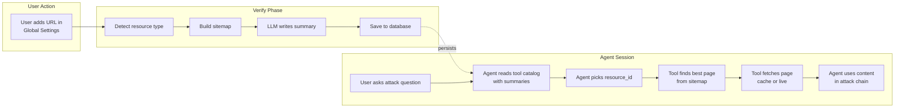
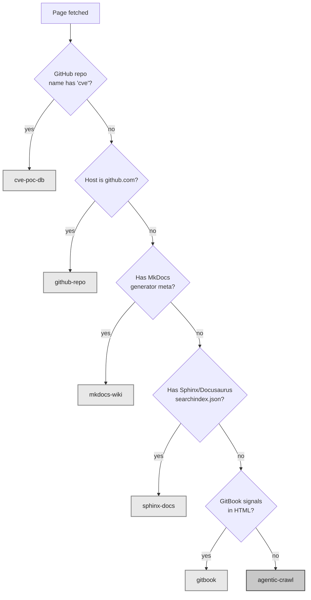
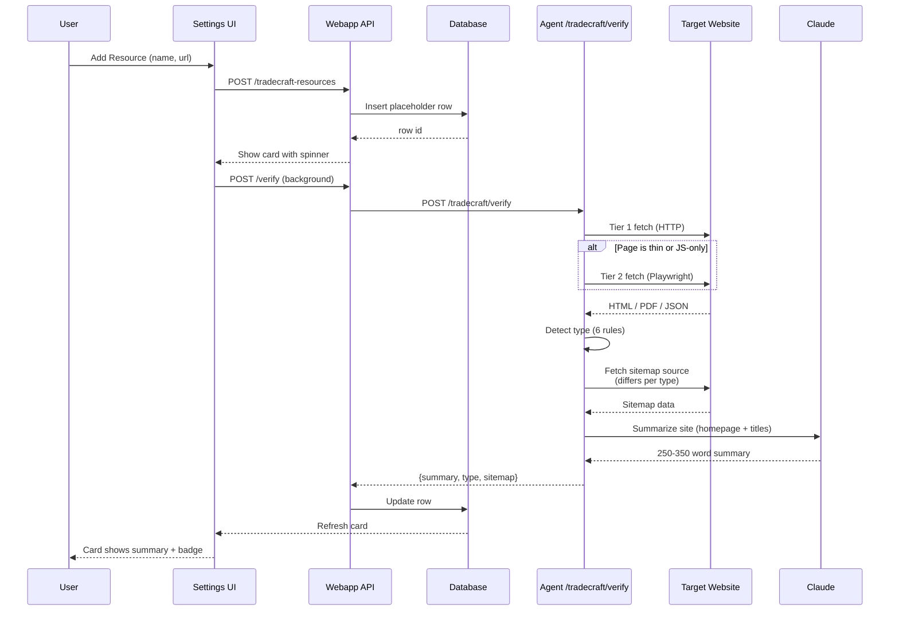
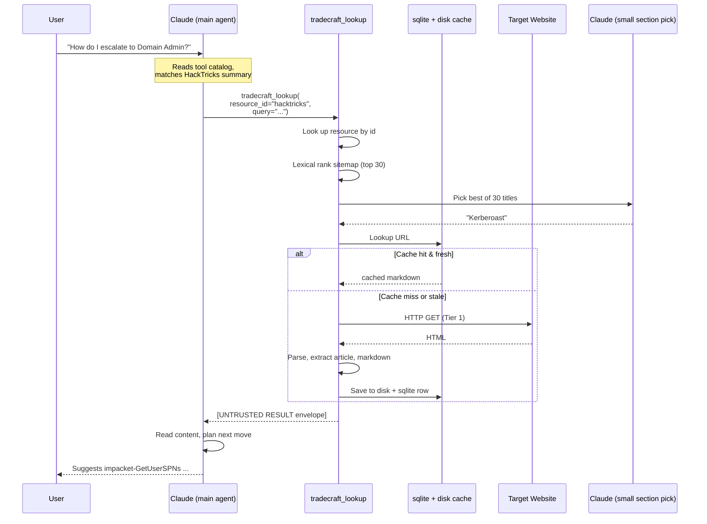
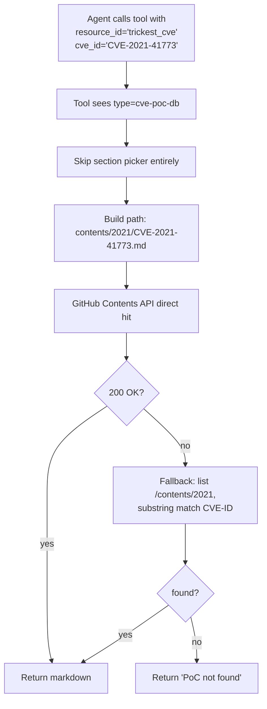
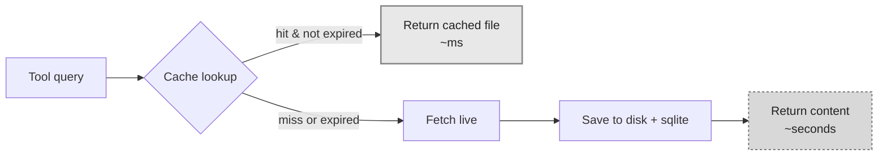
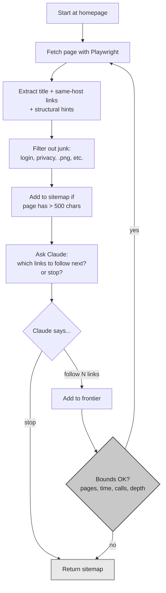
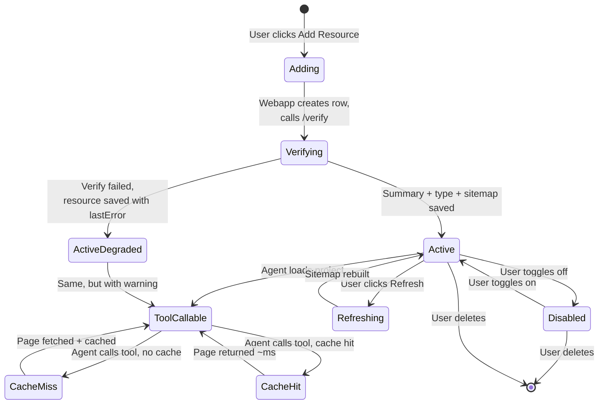

# README.TRADECRAFT

How the **Tradecraft Lookup** system works, end to end.

This document explains the workflow, not the implementation. It is for users who want to understand what happens when they add a knowledge resource and how the agent uses it during a pentest session.

---

## What is the Tradecraft Lookup tool?

A new agent tool that lets you maintain a **personal catalog of trusted hacking knowledge URLs** (HackTricks, PayloadsAllTheThings, pentest-book, h4cker, CVE PoC repositories, blogs, anything). During an attack chain, the agent picks the best resource from your catalog, fetches the specific page it needs, and uses the content to inform its next action.

Two things make it different from a normal web search:

- **You curate the sources.** The agent only consults sites you explicitly trusted.
- **The resource catalog itself becomes the agent's tool description.** When you add HackTricks, the system writes a short summary of what HackTricks covers. That summary is shown to the agent so it can decide on its own whether HackTricks is the right place to look for a given attack.

---

## The big picture



The system has two completely separate phases:

- **Verify phase** runs once when you add or refresh a resource. Slow (seconds to minutes), expensive (one or many LLM calls), produces durable data.
- **Agent session** runs every time the agent calls the tool. Fast (sub-second on cache hit), cheap (zero or one small LLM call), reads the data verify wrote.

Verify is paid once. Agent session is paid every time. This separation is what makes the tool fast at runtime.

---

# Phase 1: Adding a Resource

You open Global Settings, go to the **Tradecraft** tab, click **Add Resource**, type a name and a URL, and click Save.

Behind the scenes, six things happen.

## Step-by-step walkthrough

### Step 1: Webapp creates a placeholder row

A row is inserted into the database with just `name`, `url`, and `enabled=true`. All the interesting fields (summary, type, sitemap) are still empty. The card appears in the UI immediately with a "Verifying..." spinner.

### Step 2: Webapp asks the agent to verify

The webapp sends a request to the agent: *"Look at this URL. Tell me what kind of site it is, build a sitemap of its pages, and write a summary of what topics it covers."*

### Step 3: Agent fetches the homepage

Two-tier fetch:

1. **Tier 1**: a plain HTTP GET. Fast, cheap, works for 90% of sites.
2. **Tier 2** (only if Tier 1 returns very little or JS-rendered content): use the existing Playwright service to render the page in a real browser, then extract the content.

If the page is a PDF (`Content-Type: application/pdf`), use the PDF extractor instead and skip HTML parsing entirely.

### Step 4: Agent detects the resource type

A short heuristic chain decides which of 6 types this site is:



The first 5 types are **deterministic**: each one has a known way to get a complete sitemap quickly and cheaply. The 6th type, `agentic-crawl`, is the **fallback**: when no deterministic detector matched, an LLM-driven loop explores the site and builds a sitemap.

### Step 5: Agent builds the sitemap

The sitemap is whatever data lets us, later at query time, narrow from "the whole site" to "a single page URL" without re-crawling. Each type uses a different strategy:

| Type | Sitemap source | Time |
|---|---|---|
| `mkdocs-wiki` | Fetch `/sitemap.xml` (or `mkdocs.yml`) | ~5s |
| `github-repo` | GitHub tree API: `GET /repos/{owner}/{repo}/git/trees/{branch}?recursive=1` | ~3s |
| `cve-poc-db` | Just store `{owner, repo, branch}` (per-CVE lookups are deterministic by ID) | ~1s |
| `sphinx-docs` | Fetch `searchindex.json` (Sphinx) or `search-index.json` (Docusaurus) | ~3s |
| `gitbook` | Fetch `/sitemap.xml`, fall back to one Playwright nav harvest if 404 | ~10s |
| `agentic-crawl` | Bounded LLM-driven Playwright loop (see Agentic Crawl section below) | ~90-180s |

### Step 6: Agent writes a summary using the LLM

The agent sends Claude the homepage text plus the first 50-200 page titles from the sitemap, with a strict prompt:

> *"Write a 250-350 word description of what this site covers and when a pentest agent should consult it. Mention domains covered (web, AD, cloud, mobile), structure (per-CVE, per-payload, per-technique), and the kinds of pentest queries it answers best. No marketing, no first person."*

Example output for HackTricks:

> "Comprehensive offensive security wiki. Covers web (XSS, SSRF, SSTI, deserialization), Active Directory (Kerberoasting, DCSync, golden ticket, ADCS), Linux/Windows privesc, cloud (AWS/Azure/GCP IAM abuse), container escapes, binary exploitation. Organized per-technique with payloads and step-by-step commands. Best for: 'how do I exploit X' questions, payload retrieval, post-exploitation checklists. Not a CVE PoC index."

This text becomes the **catalog entry** that the agent will read at runtime to decide whether to call the tool.

### Step 7: Webapp persists the result

The webapp updates the database row with `summary`, `resourceType`, `sitemap`, and `lastVerifiedAt`. The card in the UI refreshes: spinner gone, type badge appears, summary visible, timestamp set.

You never need to verify again unless you click **Refresh**.

## Verify flow (sequence diagram)



---

# Phase 2: Agent Session

This is what happens during a pentest conversation, every time the agent decides to call the tool.

## Setup: when you start a new project

When you open a project, the agent loads its settings. One of those settings is now a list of all your enabled tradecraft resources (the rows you saved in Phase 1).

The agent's tool registry then **dynamically composes the tool description** by looping over your resources:

```
TOOL: tradecraft_lookup

Use this tool to fetch specific exploitation tradecraft from a known
knowledge resource.

Available resources (pick the best resource_id for your query):

  hacktricks   (mkdocs-wiki) https://book.hacktricks.wiki
    Comprehensive offensive security wiki. Covers web (XSS, SSRF,
    SSTI, deserialization), Active Directory (Kerberoasting, DCSync,
    golden ticket, ADCS), Linux/Windows privesc, cloud, container
    escapes... [the summary you saved]

  payloads     (github-repo) https://github.com/swisskyrepo/PayloadsAllTheThings
    Payload library organized per vulnerability class. Each folder
    has Intruder lists, bypass cheatsheets... [your summary]

  trickest_cve (cve-poc-db) https://github.com/trickest/cve
    CVE -> public PoC mapping. Pass cve_id="CVE-YYYY-NNNNN".
    [your summary]

Args:
  resource_id   : slug from above
  query         : free-text technique/topic
  cve_id        : required for cve-poc-db resources
  section_path  : skip auto-pick, force a specific page
  force_refresh : bypass cache
```

This description is rebuilt on every project load, so toggling a resource off in the UI removes it from the catalog on the next agent invocation.

The whole "which resource fits this query" decision is made **by Claude reading the summaries**. There is no vector database, no machine-learned routing. The summary you saved in Phase 1 is literally what drives the decision.

## Step-by-step walkthrough

You're mid attack chain. You've done recon, found an Active Directory environment, and ask: *"Find a way to escalate from a low-privilege domain user to Domain Admin."*

### Step 1: Agent decides to use the tool

Claude reads its tool list, sees `tradecraft_lookup` with HackTricks listed and described as covering "Active Directory (Kerberoasting, DCSync, golden ticket, ADCS)". It decides this is exactly the right call.

### Step 2: Agent calls the tool

```python
tradecraft_lookup(
    resource_id = "hacktricks",
    query       = "domain user to domain admin escalation"
)
```

### Step 3: Tool looks up the resource

The tool reads its in-memory list of resources (loaded from the database at project start), finds the `hacktricks` row, sees `resourceType = "mkdocs-wiki"`, and reads the saved sitemap (thousands of `{title, path}` entries).

### Step 4: Tool picks the best page from the sitemap

Two stages:

1. **Cheap lexical filter**: rank the thousands of sitemap titles by word overlap with `"domain user to domain admin escalation"`. Keep top 30 candidates: `Kerberoast`, `DCSync`, `Golden Ticket`, `ACL Abuse`, ...
2. **One small LLM call** (only if filter returned more than 5 candidates): show Claude the 30 titles and ask "which one best answers the query?". Claude returns one, e.g. `Kerberoast`.

If the LLM call fails for any reason, fall back to the top-1 lexical match.

### Step 5: Tool checks the cache

Computes the URL: `https://book.hacktricks.wiki/en/windows-hardening/active-directory-methodology/kerberoast.html`

Looks in the local sqlite cache: *"Have I fetched this in the last 7 days?"*

- **Yes** → return the cached file. Done. No HTTP call.
- **No** → continue to Step 6.

### Step 6: Tool fetches the page

Two-tier again:

1. **Tier 1**: HTTP GET, parse with BeautifulSoup (extract `<article>` or `<main>`, drop nav/footer), convert to markdown.
2. **Tier 2** (only if Tier 1 returns very little): use Playwright service to render and extract.

Save the result to disk and write a row in the sqlite cache. Subsequent calls will hit the cache.

### Step 7: Tool returns to the agent

The result is wrapped in an "untrusted content" envelope so the existing prompt-injection scrubbing applies:

```
[BEGIN UNTRUSTED TRADECRAFT RESULT]
resource: hacktricks
url: https://book.hacktricks.wiki/.../kerberoast.html
section_title: Kerberoast
fetched_at: 2026-04-26T14:02:11Z (cache miss, tier 1)
---
<the actual markdown of the Kerberoast page, capped at ~6000 chars>

Code blocks:
- bash:
    impacket-GetUserSPNs domain.local/user:password ...
- powershell:
    Invoke-Kerberoast | Out-File hashes.txt
[END UNTRUSTED TRADECRAFT RESULT]
```

### Step 8: Agent uses the content

The agent now has the actual Kerberoasting page content in its context. It reads the technique, picks the relevant commands, and proceeds with the attack chain. Maybe it generates a kali shell command using `impacket-GetUserSPNs`, then asks for the next step.

If it later needs another technique ("now I have a Kerberos ticket, how do I crack it?"), it calls the tool again. Same flow. Cache may hit if the page was already fetched recently.

## Agent session flow (sequence diagram)



---

# Special case: CVE PoC lookups

CVE PoC repositories like `trickest/cve` and `0xMarcio/cve` are special. They have **hundreds of thousands of files**, organized deterministically by CVE-ID:

```
trickest/cve/
  2021/
    CVE-2021-41773.md
    CVE-2021-44228.md
    ...
  2022/
    ...
```

There is no point in enumerating the tree (waste of time and storage) or running a section picker (the lookup key is exact). So the tool special-cases this type:



The agent's prompt sees this special requirement explicitly: the tool description for `cve-poc-db` resources says **"You MUST pass cve_id="CVE-YYYY-NNNNN""**. Claude knows to provide the ID when calling.

---

# The cache layer

All fetched pages are cached on disk. The cache is **per-resource and per-URL**, with TTLs that vary by resource type:

| Resource type | Default TTL | Why |
|---|---|---|
| `mkdocs-wiki` | 7 days | Wikis update slowly |
| `github-repo` | 7 days | Repos update slowly |
| `cve-poc-db` | 30 days | PoCs are immutable once published |
| `sphinx-docs` | 14 days | Tool docs change rarely |
| `gitbook` | 7 days | Same as wikis |
| `agentic-crawl` | 1 day | Generic blogs may update often |

Per-resource override available via `cacheTtlSec` field.



**Where it lives**: `/app/tradecraft_cache/<resource_id>/<sha256(url)>.md` on a Docker volume. SQLite at `/app/tradecraft_cache/index.sqlite` tracks `{url, fetched_at, ttl, resource_id, file_path, tier}`.

**Force refresh**: pass `force_refresh=True` in the tool call, or click "Refresh" in the UI to invalidate the cache for that resource.

---

# The agentic-crawl fallback

When you add a URL that does not match any of the 5 deterministic types (a personal blog, a custom CMS, an internal wiki without published sitemap), the system falls back to **agentic-crawl**: a bounded LLM-driven loop that explores the site with Playwright and builds a sitemap.

This runs **only at verify time**, never at query time. So it is slow once (90-180 seconds), then forever fast.

## How the loop works



## The bounds (always enforced)

| Bound | Default | Setting name |
|---|---|---|
| Max pages visited | 30 | `TRADECRAFT_CRAWL_MAX_PAGES` |
| Max LLM calls | 20 | `TRADECRAFT_CRAWL_MAX_LLM_CALLS` |
| Wall-clock budget | 180s | `TRADECRAFT_CRAWL_TIME_BUDGET_SEC` |
| Max link depth from home | 3 | `TRADECRAFT_CRAWL_MAX_DEPTH` |

If any single bound trips, the loop exits and returns whatever sitemap it built. The reason is shown in the UI badge: *"Crawled 27 pages, hit time budget"*.

## What the LLM sees per iteration

For each page the loop visits, Claude gets a short prompt with:

- The current page URL and title
- The list of unvisited same-host links (top 20, with anchor text)
- A small sample of what is already in the sitemap
- Remaining budget
- Page hints (search box present? pagination? tag cloud?)

Claude returns JSON: either `{"action": "stop"}` or `{"action": "follow", "indices": [1, 4, 7]}`.

## Cost envelope

Per verify of an agentic-crawl resource:
- **Time**: 90 to 180 seconds
- **LLM calls**: 15 to 25
- **Cost**: about $0.30 to $0.60 (with Sonnet)

Paid once when you add the resource. Query-time stays sub-second because the sitemap is then just JSON in the database.

---

# Putting it all together

## Lifecycle of one tradecraft resource



## What happens when a resource is disabled

The tool's docstring is rebuilt every time a project loads its settings. Disabled resources are filtered out **before** the docstring is built, so the agent literally cannot see them as options. There is no risk of the agent trying to call a disabled resource.

If the agent has a stale conversation and tries to call a slug that no longer exists (e.g. you deleted it), the tool returns an error envelope: `Resource '<slug>' not configured`. The agent recovers and tries something else.

---

# Comparison with existing tools

The tradecraft tool is intentionally separate from the existing `web_search` and the FAISS knowledge base. They serve different needs:

| Tool | When to use | Source freshness | Latency |
|---|---|---|---|
| `web_search` | General research, open-web context, recent news | Real-time (Tavily) + pre-ingested KB | 1-3s |
| FAISS KB (inside web_search) | Pre-ingested security corpora (gtfobins, lolbas, owasp, nvd, exploitdb, nuclei) | Stale unless re-ingested | <1s |
| `tradecraft_lookup` | Specific exploitation technique, payload, or PoC from a trusted curated source | Always fresh (live fetch with cache) | <1s on cache hit, 1-5s on miss |

The agent's prompt is updated to tell it: **prefer `tradecraft_lookup` after `query_graph` and `web_search` when you need a specific exploitation page or PoC, not general background.**

---

# Summary of the three moving parts

| Part | When it runs | What it does |
|---|---|---|
| **Verify** | Once when you click Save (and on Refresh) | Downloads homepage, detects type, builds sitemap, asks Claude for a summary. Saves all of it to the database row. Slow but durable. |
| **Tool description build** | Every time the agent loads a project | Reads enabled resources, composes a text description listing each one with its saved summary. Hands it to Claude as the tool's documentation. Instant. |
| **Tool call** | When Claude decides to call the tool during chat | Picks the right page from the sitemap, fetches it (or hits cache), returns content to Claude. Sub-second on cache hit. |

The summary you save at add-time is **the entire intelligence behind which site Claude picks**. The sitemap you save at add-time is **what lets the tool find the right page without re-crawling**. Everything else is plumbing.

---

# Glossary

- **Tradecraft**: applied operator knowledge for offensive security. The "how to actually do it" between theory and tools. Originally a CIA term for spy operational skills.
- **Resource**: one URL you added to the catalog (e.g. HackTricks).
- **Resource type**: one of 6 categories (`mkdocs-wiki`, `github-repo`, `cve-poc-db`, `sphinx-docs`, `gitbook`, `agentic-crawl`) that determines how the system extracts a sitemap.
- **Sitemap**: the per-resource map of pages, stored as JSON in the database. Built once at verify time.
- **Catalog**: the dynamic tool description built from all enabled resources, shown to the agent at runtime.
- **Verify**: the one-time process of fetching, typing, sitemap-building, and summarizing a newly-added resource.
- **Section picker**: the at-query-time logic that narrows a sitemap to one page URL using lexical ranking + an optional small Claude call.
- **Tier 1 / Tier 2**: two-step content fetch. Tier 1 is plain HTTP, Tier 2 is Playwright. Used both at verify time and query time.
